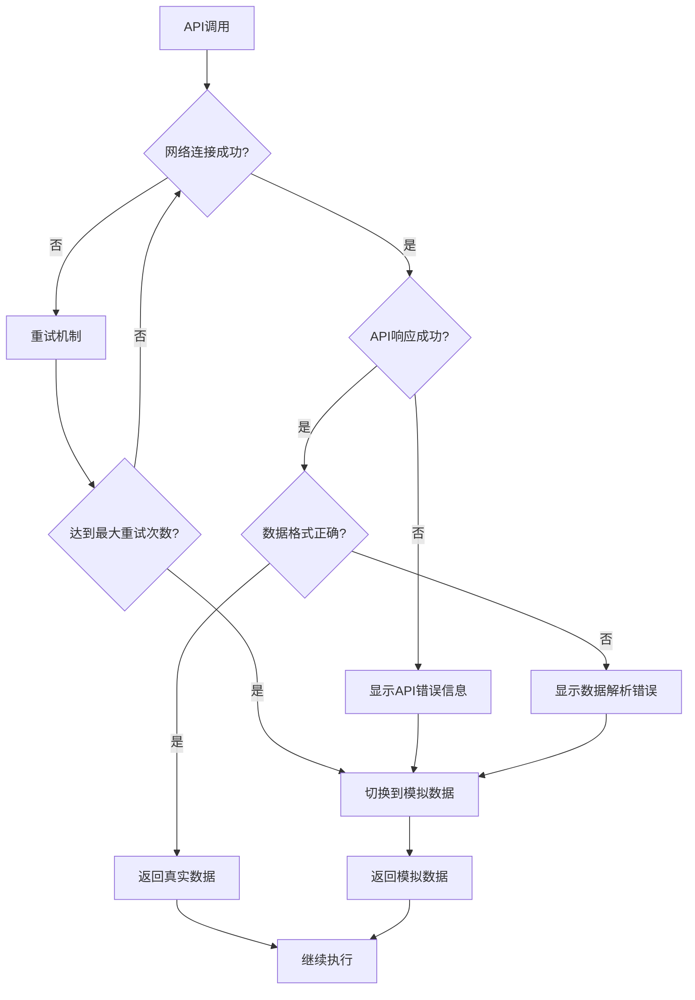

# 教程质量改进设计文档

## 概述

本设计文档描述了如何系统性地改进 Project Argus QMT 数据代理服务的教程文件质量。通过创建统一的工具库、修复语法错误、改进错误处理机制和优化代码结构，我们将显著提升开发者体验和教程的实用性。

## 架构

### 核心组件

```
tutorials/
├── common/
│   ├── __init__.py
│   ├── api_client.py          # 统一的API客户端
│   ├── mock_data.py           # 模拟数据生成器
│   ├── utils.py               # 通用工具函数
│   └── config.py              # 配置管理
├── 01_trading_dates.py        # 重构后的教程文件
├── 02_hist_kline.py
├── 03_instrument_detail.py
├── 04_stock_list.py
├── 06_latest_market.py
├── 07_full_market.py
└── README.md                  # 教程使用指南
```

### 设计原则

1. **DRY (Don't Repeat Yourself)**: 消除重复代码，创建共享的工具库
2. **统一错误处理**: 所有教程使用相同的错误处理模式
3. **优雅降级**: API不可用时自动切换到模拟数据
4. **清晰的结构**: 每个教程遵循相同的组织结构
5. **性能监控**: 内置响应时间和性能统计

## 组件和接口

### 1. API客户端 (api_client.py)

```python
class QMTAPIClient:
    """统一的QMT API客户端"""
    
    def __init__(self, base_url: str = None, timeout: int = 10, max_retries: int = 3):
        """初始化API客户端"""
        
    def call_api(self, endpoint: str, params: dict = None, **kwargs) -> dict:
        """统一的API调用方法，包含重试和错误处理"""
        
    def get_trading_dates(self, market: str, start_date: str = None, end_date: str = None, count: int = -1) -> list:
        """获取交易日历"""
        
    def get_hist_kline(self, symbol: str, start_date: str, end_date: str, frequency: str = "1d") -> dict:
        """获取历史K线数据"""
        
    # 其他API方法...
```

### 2. 模拟数据生成器 (mock_data.py)

```python
class MockDataGenerator:
    """模拟数据生成器，用于API不可用时的降级处理"""
    
    @staticmethod
    def generate_trading_dates(market: str, start_date: str = None, end_date: str = None, count: int = -1) -> list:
        """生成模拟交易日历数据"""
        
    @staticmethod
    def generate_hist_kline(symbol: str, start_date: str, end_date: str, frequency: str = "1d") -> dict:
        """生成模拟历史K线数据"""
        
    # 其他模拟数据生成方法...
```

### 3. 通用工具函数 (utils.py)

```python
def format_response_time(seconds: float) -> str:
    """格式化响应时间显示"""
    
def print_section_header(title: str) -> None:
    """打印章节标题"""
    
def print_api_result(result: dict, title: str = None) -> None:
    """统一的API结果显示格式"""
    
def validate_date_format(date_str: str) -> bool:
    """验证日期格式"""
    
class PerformanceMonitor:
    """性能监控工具"""
    
    def __init__(self):
        self.stats = {}
        
    def record_api_call(self, endpoint: str, duration: float, success: bool):
        """记录API调用性能"""
        
    def print_summary(self):
        """打印性能统计摘要"""
```

### 4. 配置管理 (config.py)

```python
class TutorialConfig:
    """教程配置管理"""
    
    # API配置
    DEFAULT_BASE_URL = "http://127.0.0.1:8000"
    DEFAULT_TIMEOUT = 10
    MAX_RETRIES = 3
    
    # 演示配置
    DEMO_SYMBOLS = ["600519.SH", "000858.SZ", "601318.SH", "000001.SZ", "600036.SH"]
    DEMO_MARKETS = ["SH", "SZ"]
    
    # 显示配置
    MAX_DISPLAY_ITEMS = 10
    ENABLE_PERFORMANCE_MONITORING = True
```

## 数据模型

### API响应标准化

所有API响应将遵循统一的格式：

```python
{
    "code": 0,           # 0表示成功，非0表示错误
    "message": "success", # 状态消息
    "data": {...},       # 实际数据
    "timestamp": 1234567890,  # 响应时间戳
    "duration": 0.123    # 处理耗时（秒）
}
```

### 教程结构标准化

每个教程文件将遵循以下结构：

```python
# 1. 文件头部注释和导入
# 2. 配置和初始化
# 3. 基础演示函数
# 4. 高级演示函数
# 5. 性能测试函数
# 6. 错误处理演示
# 7. 主函数执行
```

## 错误处理

### 错误分类和处理策略

1. **网络连接错误**
   - 自动重试最多3次
   - 显示清晰的错误信息
   - 提供解决建议

2. **API服务不可用**
   - 自动切换到模拟数据模式
   - 显示降级提示
   - 继续执行演示

3. **参数验证错误**
   - 显示参数格式要求
   - 提供正确的示例
   - 跳过错误的演示

4. **数据解析错误**
   - 记录原始响应数据
   - 显示解析失败的原因
   - 使用默认值继续执行

### 错误处理流程



## 测试策略

### 单元测试

- 测试API客户端的各种错误情况
- 测试模拟数据生成器的数据质量
- 测试工具函数的边界条件

### 集成测试

- 测试完整的教程执行流程
- 测试API服务可用和不可用的情况
- 测试性能监控功能

### 用户验收测试

- 验证所有教程文件可以无错误运行
- 验证错误处理的用户友好性
- 验证性能统计的准确性

## 性能优化

### 响应时间监控

- 记录每个API调用的响应时间
- 统计平均响应时间和成功率
- 识别性能瓶颈

### 资源使用优化

- 复用HTTP连接
- 合理设置超时时间
- 避免不必要的重复调用

### 缓存策略

- 对于相对静态的数据（如交易日历）实现本地缓存
- 设置合理的缓存过期时间
- 提供缓存清理机制

## 文档和用户体验

### 代码注释标准

- 每个函数都有详细的docstring
- 关键逻辑有行内注释
- 复杂算法有解释说明

### 输出格式统一

- 使用一致的日志格式
- 统一的成功/失败提示
- 清晰的章节分隔

### 学习路径设计

- 从简单到复杂的演示顺序
- 每个演示都有明确的学习目标
- 提供实际应用场景的示例