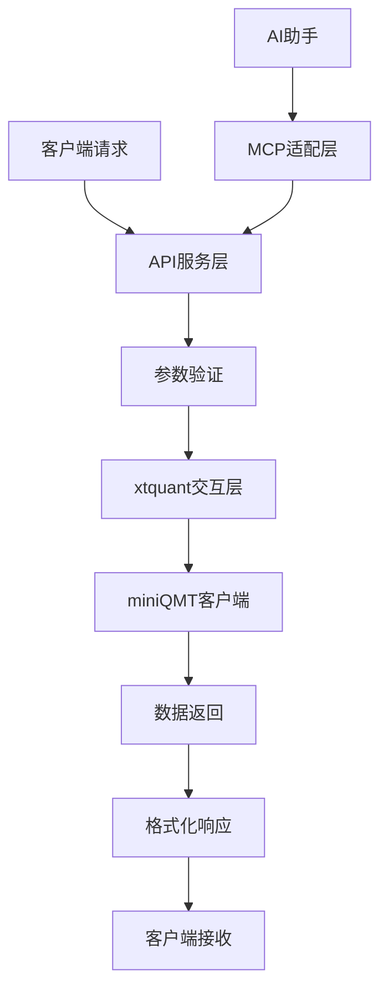

## 1. 项目概述

Project Argus QMT Data Agent 是一个专为量化交易系统设计的数据代理服务，旨在解决 miniQMT（迅投量化交易客户端）与现代云原生系统之间的平台兼容性问题。该项目通过提供标准化的 HTTP API 接口，实现了 Windows 环境下的 miniQMT 数据与跨平台量化分析系统的无缝集成。

项目的核心价值在于环境解耦、提供稳定可靠的API服务，并为未来的AI集成奠定基础。通过这个数据代理层，量化团队可以通过标准化的HTTP API接口稳定访问 miniQMT 的实时和历史金融数据。

## 2. 核心功能

### 2.1 用户角色
本项目主要服务于以下用户角色：

| 角色 | 注册方式 | 核心权限 |
|------|----------|----------|
| 量化分析师 | API Key 认证 | 可访问所有数据查询接口，进行策略回测和数据分析 |
| 数据工程师 | API Key 认证 | 可访问数据接口，构建数据管道和ETL流程 |
| DevOps工程师 | 系统级访问 | 可访问监控接口，进行系统运维和故障排查 |

### 2.2 功能模块
项目包含以下核心页面和功能模块：

1. **API服务层**: 基于FastAPI的RESTful接口服务，提供标准化数据访问
2. **数据交互层**: 与miniQMT客户端的xtquant库进行数据交互
3. **MCP适配层**: 支持Model Context Protocol，实现AI工具集成
4. **监控运维模块**: 提供系统健康检查、日志记录和性能监控

### 2.3 页面详情

| 页面名称 | 模块名称 | 功能描述 |
|----------|----------|----------|
| API文档页面 | Swagger UI | 提供交互式API文档，支持在线测试和参数说明 |
| 健康检查页面 | 系统监控 | 显示服务状态、连接状态和系统资源使用情况 |
| 数据查询接口 | 核心API | 包含交易日历、历史K线、实时行情、合约详情等数据接口 |
| MCP服务端点 | AI集成 | 支持AI助手通过自然语言查询金融数据 |

## 3. 核心流程

### 数据查询流程
用户通过以下流程获取金融数据：
1. 客户端发送HTTP请求到API服务层
2. API服务层验证请求参数和认证信息
3. 调用xtquant交互层获取miniQMT数据
4. 数据格式化并返回标准JSON响应

### AI集成流程（未来规划）
1. AI助手通过MCP协议连接到数据代理
2. 解析自然语言查询指令
3. 转换为对应的API调用
4. 返回结构化数据结果

## 4. 用户界面设计

### 4.1 设计风格
- **主色调**: 深蓝色 (#1f2937) 和白色 (#ffffff)
- **辅助色**: 绿色 (#10b981) 用于成功状态，红色 (#ef4444) 用于错误状态
- **按钮样式**: 圆角矩形，3D阴影效果
- **字体**: 系统默认字体，代码区域使用等宽字体
- **布局风格**: 简洁的卡片式布局，响应式设计
- **图标风格**: 简约线性图标，支持深色和浅色主题

### 4.2 页面设计概览

| 页面名称 | 模块名称 | UI元素 |
|----------|----------|--------|
| API文档页面 | Swagger界面 | 深色主题，折叠式API分组，交互式参数输入框，实时响应预览 |
| 监控面板 | 系统状态 | 实时数据图表，状态指示灯，响应时间曲线，错误率统计 |
| 配置页面 | 系统设置 | 表单式配置界面，参数验证提示，保存确认对话框 |

### 4.3 响应式设计
项目采用桌面优先的设计策略，同时支持移动端适配。API文档页面在移动设备上会自动调整布局，确保良好的触控体验。监控面板支持手势操作，方便在平板设备上进行运维操作。