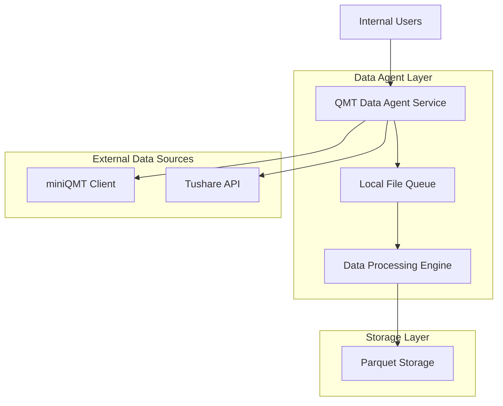
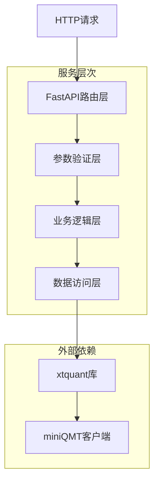
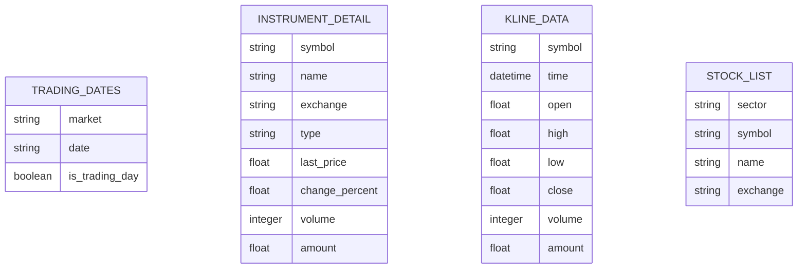

## 1.Architecture design



## 2.Technology Description

**内部系统架构 - 无需API认证**

- Backend: FastAPI + Python 3.9+
- Data Processing: Pandas + NumPy
- Storage: Parquet + Local File System
- External APIs: xtquant + Tushare Pro
- Security: Windows凭据管理器 (内部系统，无需API认证)
- Monitoring: 基础日志记录

## 3. 路由定义

| 路由 | 用途 |
|------|------|
| `/` | 服务根路径，返回欢迎信息 |
| `/docs` | Swagger API文档界面 |
| `/health` | 健康检查端点 |
| `/api/v1/get_trading_dates` | 获取交易日历数据 |
| `/api/v1/instrument_detail/{symbol}` | 获取合约详细信息 |
| `/api/v1/stock_list_in_sector` | 获取板块股票列表 |
| `/api/v1/latest_market_data` | 获取最新行情数据 |
| `/api/v1/full_market_data` | 获取完整行情数据 |
| `/hist_kline` | 获取历史K线数据 |
| `/latest_market` | 获取最新市场快照 |
| `/stock_list` | 获取股票列表 |
| `/instrument_detail` | 获取合约信息 |

## 4. API定义

### 4.1 核心API

#### 交易日历查询
```
GET /api/v1/get_trading_dates
```

请求参数:
| 参数名称 | 参数类型 | 是否必需 | 描述 |
|----------|----------|----------|------|
| market | string | true | 市场代码，如"SH"、"SZ" |
| start_time | string | false | 开始日期，格式YYYYMMDD |
| end_time | string | false | 结束日期，格式YYYYMMDD |
| count | integer | false | 返回记录数，-1表示全部 |

响应格式:
| 参数名称 | 参数类型 | 描述 |
|----------|----------|------|
| code | integer | 响应状态码 |
| message | string | 响应消息 |
| data | array | 交易日期列表 |

示例:
```json
{
  "code": 0,
  "message": "success",
  "data": ["20250101", "20250102", "20250103"]
}
```

#### 历史K线数据查询
```
GET /hist_kline
```

请求参数:
| 参数名称 | 参数类型 | 是否必需 | 描述 |
|----------|----------|----------|------|
| symbol | string | true | 股票代码，如"600519.SH" |
| start_date | string | true | 开始日期，格式YYYYMMDD |
| end_date | string | true | 结束日期，格式YYYYMMDD |
| frequency | string | true | 数据频率，如"1d"、"1m" |

响应格式:
| 参数名称 | 参数类型 | 描述 |
|----------|----------|------|
| success | boolean | 请求是否成功 |
| data | array | K线数据数组 |
| status | integer | HTTP状态码 |

示例:
```json
{
  "success": true,
  "data": [
    {
      "time": "2023-01-03 00:00:00",
      "open": 1650.0,
      "high": 1680.0,
      "low": 1640.0,
      "close": 1670.0,
      "volume": 1234567
    }
  ],
  "status": 200
}
```

#### 合约详情查询
```
GET /api/v1/instrument_detail/{symbol}
```

请求参数:
| 参数名称 | 参数类型 | 是否必需 | 描述 |
|----------|----------|----------|------|
| symbol | string | true | 股票代码，如"600519.SH" |

响应格式:
| 参数名称 | 参数类型 | 描述 |
|----------|----------|------|
| symbol | string | 股票代码 |
| name | string | 股票名称 |
| last_price | float | 最新价格 |
| change_percent | float | 涨跌幅 |
| volume | integer | 成交量 |

## 5. 服务架构图



## 6. 数据模型

### 6.1 数据模型定义



### 6.2 配置数据结构

由于本项目主要作为数据代理服务，不涉及复杂的数据库设计，主要的数据结构体现在API响应格式中：

#### 统一响应格式
```python
class APIResponse:
    code: int = 0  # 0表示成功，非0表示错误
    message: str = "success"  # 响应消息
    data: Any = None  # 实际数据内容
```

#### K线数据结构
```python
class KLineData:
    time: str  # 时间戳
    open: float  # 开盘价
    high: float  # 最高价
    low: float  # 最低价
    close: float  # 收盘价
    volume: int  # 成交量
```

#### 合约信息结构
```python
class InstrumentDetail:
    symbol: str  # 股票代码
    name: str  # 股票名称
    exchange: str  # 交易所
    last_price: float  # 最新价
    change_percent: float  # 涨跌幅
    volume: int  # 成交量
    amount: float  # 成交额
```