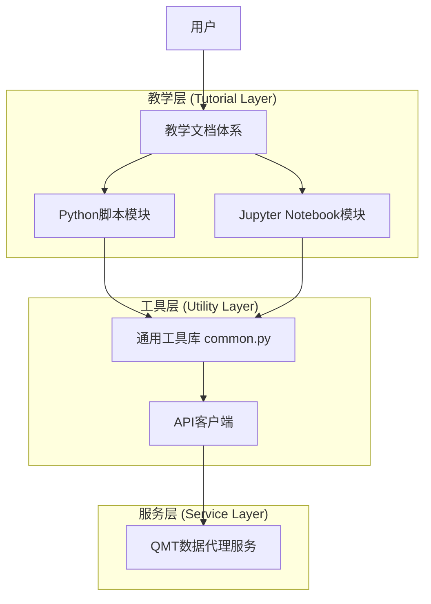
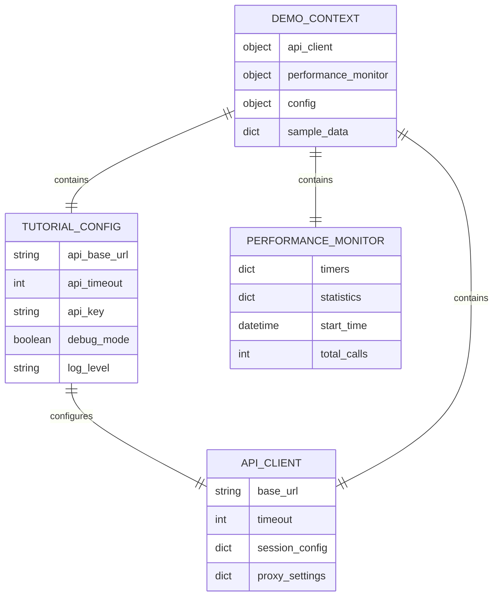

# 教学文档体系技术架构文档

## 1. 架构设计



## 2. 技术描述

- **教学框架**: Python 3.11+ + Jupyter Notebook
- **转换工具**: jupytext (Python脚本与Notebook互转)
- **API客户端**: requests + 自定义APIClient类
- **数据处理**: pandas + numpy
- **可视化**: matplotlib (可选)
- **文档格式**: Markdown + reStructuredText

## 3. 目录结构定义

| 路径 | 用途 |
|------|------|
| /tutorials/ | Python教学脚本根目录 |
| /tutorials/notebooks/ | Jupyter Notebook文件目录 |
| /tutorials/common.py | 通用工具库和API客户端 |
| /tutorials/README.md | 教学体系使用指南 |
| /tutorials/TUTORIAL_INDEX.md | 教学索引和学习路径 |
| /tutorials/VALIDATION_REPORT.md | 验证报告和质量评估 |
| /tutorials/TROUBLESHOOTING.md | 故障排除和技术支持 |

## 4. API定义

### 4.1 核心工具函数

**通用API客户端**
```python
class APIClient:
    def __init__(self, base_url: str, timeout: int = 30)
    def get_trading_dates(self, market: str, start_date: str, end_date: str) -> Dict
    def get_hist_kline(self, symbol: str, start_date: str, end_date: str, frequency: str) -> Dict
    def get_instrument_detail(self, symbol: str) -> Dict
    def get_stock_list(self, sector: str) -> Dict
    def get_latest_market(self, symbols: List[str]) -> Dict
    def get_full_market(self, symbol: str, fields: List[str]) -> Dict
```

**配置管理**
```python
class TutorialConfig:
    def __init__(self)
    def get_api_config(self) -> APIConfig
    def get_display_config(self) -> DisplayConfig
    def load_from_env(self) -> None
```

**性能监控**
```python
class PerformanceMonitor:
    def start_timer(self, operation: str) -> None
    def end_timer(self, operation: str) -> float
    def get_statistics(self) -> Dict
    def reset_statistics(self) -> None
```

### 4.2 教学辅助函数

**安全API调用**
```python
def safe_api_call(url: str, params: Dict, timeout: int = 30, retries: int = 3) -> Dict
```

**格式化输出**
```python
def print_section_header(title: str) -> None
def print_subsection_header(title: str) -> None
def print_api_result(result: Dict, title: str = "") -> None
def format_number(value: float, precision: int = 2) -> str
def format_response_time(seconds: float) -> str
```

**演示上下文**
```python
def create_demo_context() -> DemoContext
def get_date_range(days: int = 7) -> Tuple[str, str]
def create_api_client() -> APIClient
```

## 5. 数据模型

### 5.1 数据模型定义



### 5.2 配置数据结构

**API配置类**
```python
@dataclass
class APIConfig:
    base_url: str = "http://127.0.0.1:8000"
    timeout: int = 30
    api_key: Optional[str] = None
    retry_count: int = 3
    retry_delay: float = 1.0
```

**显示配置类**
```python
@dataclass
class DisplayConfig:
    show_headers: bool = True
    show_performance: bool = True
    show_errors: bool = True
    max_rows: int = 10
    precision: int = 4
```

**演示上下文类**
```python
@dataclass
class DemoContext:
    api_client: APIClient
    performance_monitor: PerformanceMonitor
    config: TutorialConfig
    sample_symbols: List[str]
    sample_sectors: List[str]
```

## 6. 文件转换流程

### 6.1 Jupytext转换配置

**Python脚本格式**
```python
# -*- coding: utf-8 -*-
# ---
# jupyter:
#   jupytext:
#     text_representation:
#       extension: .py
#       format_name: light
#       format_version: '1.5'
#       jupytext_version: 1.14.1
#   kernelspec:
#     display_name: Python 3
#     language: python
#     name: python3
# ---
```

**转换命令**
```bash
# Python脚本转Notebook
jupytext --to ipynb tutorials/01_trading_dates.py --output tutorials/notebooks/01_trading_dates.ipynb

# 批量转换
for file in tutorials/*.py; do
    if [[ "$file" != *"common.py"* ]]; then
        filename=$(basename "$file" .py)
        jupytext --to ipynb "$file" --output "tutorials/notebooks/${filename}.ipynb"
    fi
done
```

### 6.2 质量保证流程

**验证检查项**
1. Python脚本语法检查
2. Notebook转换成功验证
3. API调用功能测试
4. 代码执行结果验证
5. 文档格式规范检查
6. 链接有效性验证

**自动化验证脚本**
```python
def validate_tutorial_system():
    """验证教学文档体系的完整性和正确性"""
    results = {
        "python_files": validate_python_files(),
        "notebook_files": validate_notebook_files(),
        "api_functionality": validate_api_calls(),
        "documentation": validate_documentation(),
        "links": validate_links()
    }
    return results
```

## 7. 部署和维护

### 7.1 环境要求

**Python环境**
```bash
Python 3.11+
jupytext>=1.14.0
requests>=2.28.0
pandas>=1.5.0
numpy>=1.24.0
matplotlib>=3.6.0 (可选)
```

**系统要求**
- Windows 10/11 (主要支持平台)
- macOS 10.15+ (兼容性支持)
- Linux Ubuntu 20.04+ (兼容性支持)

### 7.2 维护流程

**定期维护任务**
1. 验证所有教学文档的可执行性
2. 更新API调用示例和参数
3. 检查外部链接的有效性
4. 更新依赖库版本
5. 收集用户反馈并改进内容

**版本控制策略**
- 主要版本：重大功能更新或架构变更
- 次要版本：新增教学模块或重要功能
- 补丁版本：错误修复和内容更新

**质量监控指标**
- 教学文档执行成功率 > 95%
- API调用响应时间 < 5秒
- 用户学习完成率 > 80%
- 错误报告解决时间 < 24小时
