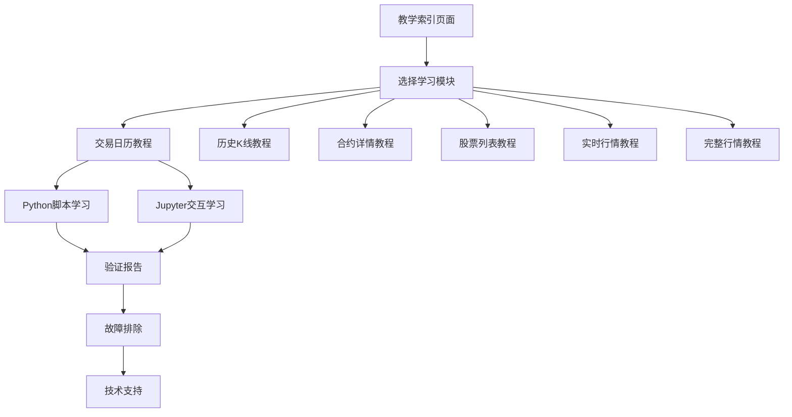

# 教学文档体系产品需求文档

## 1. 产品概览

**Project Argus QMT 教学文档体系**是一个完整的API学习和实践平台，旨在帮助用户快速掌握QMT数据代理服务的使用方法。该体系提供双格式教学文档（Python脚本和Jupyter Notebook），涵盖从基础API调用到高级数据分析的完整学习路径。

教学体系解决了金融数据API学习门槛高、缺乏实践指导的问题，为量化分析师、数据工程师和AI开发者提供了标准化的学习资源。通过系统化的教学设计，用户可以在最短时间内掌握核心功能，提高开发效率。

## 2. 核心功能

### 2.1 用户角色

| 角色 | 使用方式 | 核心权限 |
|------|----------|----------|
| 初学者 | 按序学习教程模块 | 可访问所有基础教学内容，获得分步指导 |
| 开发者 | 参考代码示例和最佳实践 | 可复制代码片段，查看完整实现方案 |
| 高级用户 | 深度定制和扩展功能 | 可修改教学代码，创建自定义分析流程 |

### 2.2 功能模块

我们的教学文档体系包含以下核心页面：

1. **教学索引页面**: 学习路径规划、模块导航、进度跟踪
2. **交易日历教程**: 市场交易日期查询、多市场对比、日期验证
3. **历史K线教程**: OHLCV数据获取、技术指标计算、数据可视化
4. **合约详情教程**: 股票信息查询、批量处理、数据验证
5. **股票列表教程**: 板块数据分析、成分股筛选、市场统计
6. **实时行情教程**: 最新价格监控、预警设置、性能优化
7. **完整行情教程**: 深度数据分析、高级统计、自定义指标
8. **验证报告页面**: 教学质量评估、功能验证、问题追踪
9. **故障排除页面**: 常见问题解答、错误处理、技术支持

### 2.3 页面详情

| 页面名称 | 模块名称 | 功能描述 |
|----------|----------|----------|
| 教学索引 | 导航系统 | 提供完整学习路径，支持模块跳转和进度跟踪 |
| 交易日历教程 | API调用演示 | 演示基础API调用，包含错误处理和性能监控 |
| 历史K线教程 | 数据分析模块 | 获取OHLCV数据，计算技术指标，生成可视化图表 |
| 合约详情教程 | 信息查询模块 | 单个和批量股票信息查询，数据格式验证 |
| 股票列表教程 | 板块分析模块 | 板块数据下载，成分股分析，市场表现统计 |
| 实时行情教程 | 监控系统 | 实时数据处理，预警规则设置，性能优化示例 |
| 完整行情教程 | 高级分析 | 深度行情分析，市场统计，自定义数据处理 |
| 验证报告 | 质量保证 | 教学文档验证状态，功能测试结果，质量评估 |
| 故障排除 | 技术支持 | 常见问题解决方案，错误代码说明，联系方式 |

## 3. 核心流程

**初学者学习流程**：
用户首先访问教学索引页面了解整体结构 → 按照推荐路径从交易日历教程开始 → 逐步学习各个API模块 → 通过Jupyter Notebook进行交互式实践 → 参考故障排除页面解决问题 → 查看验证报告确认学习效果

**开发者参考流程**：
开发者直接访问相关教程模块 → 查看代码示例和最佳实践 → 复制和修改代码片段 → 集成到自己的项目中 → 参考性能优化建议 → 使用故障排除指南解决集成问题

**高级用户定制流程**：
高级用户分析现有教学代码 → 理解底层实现逻辑 → 基于通用工具库创建自定义功能 → 扩展数据分析能力 → 优化性能和错误处理 → 贡献改进建议

## 4. 用户界面设计

### 4.1 设计风格

- **主色调**: 深蓝色 (#1e3a8a) 和浅蓝色 (#3b82f6)，体现专业性和技术感
- **辅助色**: 绿色 (#10b981) 表示成功，红色 (#ef4444) 表示错误，黄色 (#f59e0b) 表示警告
- **按钮样式**: 圆角矩形按钮，悬停时有阴影效果
- **字体**: 代码使用等宽字体 Consolas/Monaco，文档使用无衬线字体 Arial/Helvetica
- **布局风格**: 卡片式布局，清晰的模块分割，响应式设计
- **图标风格**: 简洁的线性图标，统一的视觉语言

### 4.2 页面设计概览

| 页面名称 | 模块名称 | UI元素 |
|----------|----------|--------|
| 教学索引 | 导航卡片 | 模块卡片网格布局，进度条显示，快速跳转按钮 |
| 教程页面 | 代码展示区 | 语法高亮代码块，可复制按钮，执行结果展示 |
| 教程页面 | 说明文档区 | Markdown渲染，步骤编号，重点标注 |
| 教程页面 | 交互控制区 | 运行按钮，参数输入框，结果下载链接 |
| 验证报告 | 状态表格 | 彩色状态指示器，完成度进度条，详细信息展开 |
| 故障排除 | 问题分类 | 可折叠的FAQ列表，搜索功能，标签分类 |

### 4.3 响应式设计

教学文档体系采用桌面优先的设计策略，同时兼容移动设备访问。在桌面环境下提供完整的代码编辑和执行功能，在移动设备上优化阅读体验和基础交互。支持触摸操作优化，包括代码块的滑动查看和快速复制功能。
