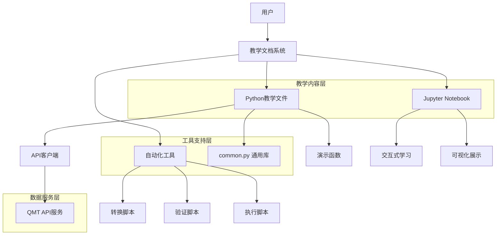
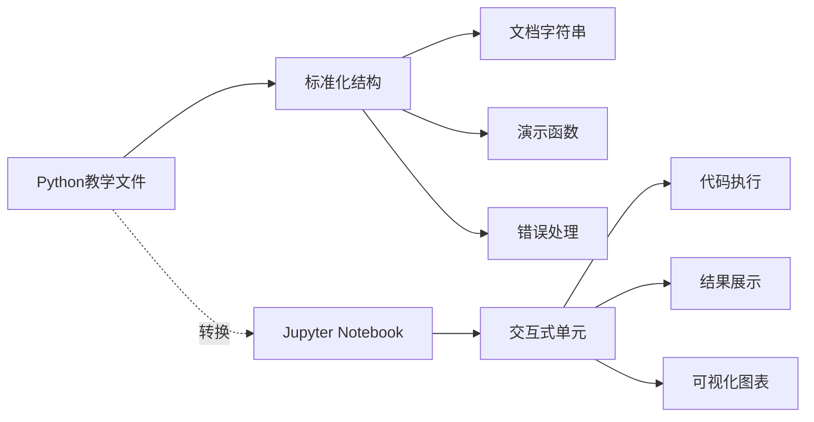
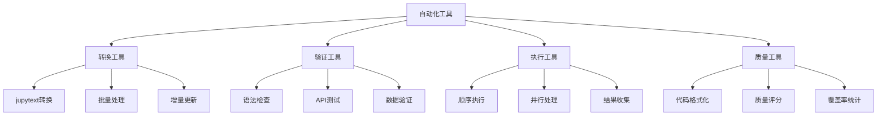
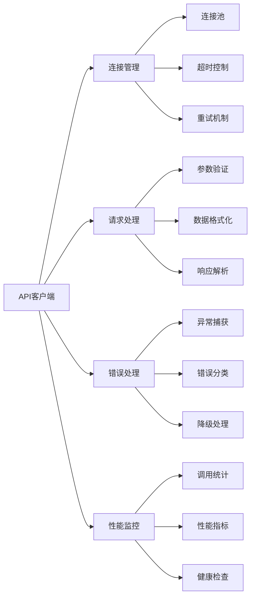
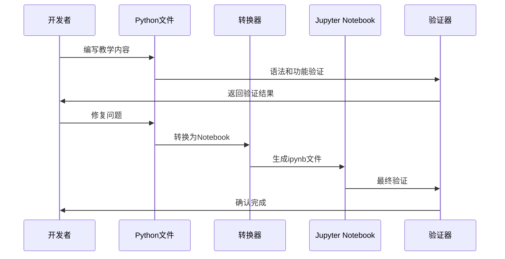
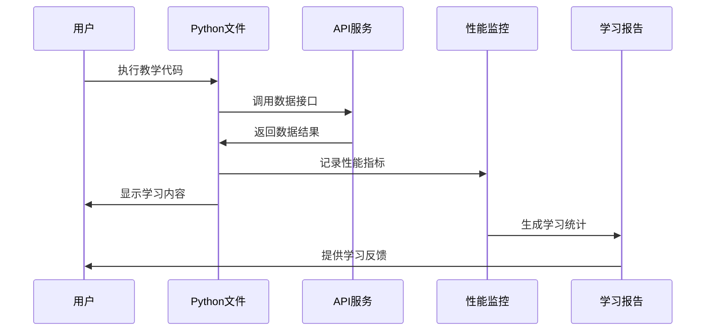
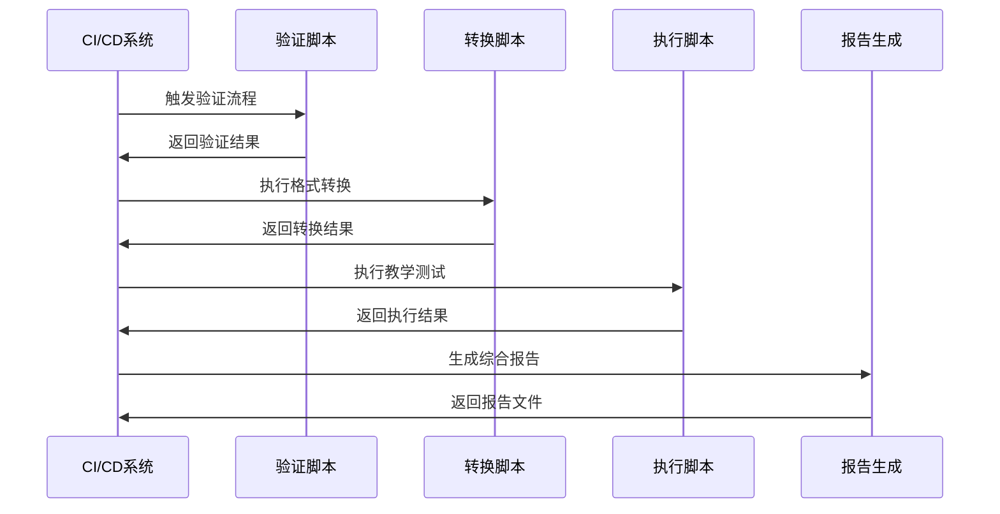

# Project Argus QMT 教学文档系统技术架构

## 1. 架构设计



## 2. 技术描述

### 2.1 核心技术栈
- **Python 3.8+**: 主要编程语言和教学环境
- **Jupyter**: 交互式教学和演示平台
- **Jupytext**: Python文件与Notebook格式转换
- **Requests**: HTTP API客户端库
- **Pytest**: 自动化测试框架

### 2.2 开发工具
- **Black**: 代码格式化工具
- **Flake8**: 代码质量检查
- **MyPy**: 静态类型检查
- **isort**: 导入语句排序
- **Pre-commit**: Git提交前检查

### 2.3 文档工具
- **Markdown**: 文档编写格式
- **Mermaid**: 流程图和架构图
- **Sphinx**: API文档生成
- **MkDocs**: 静态文档站点生成

## 3. 系统组件架构

### 3.1 教学内容层



**Python教学文件结构:**
```python
# 文件头部 (Jupytext元数据)
# 文档字符串 (学习目标、背景知识、操作步骤)
# 导入语句 (通用库和API客户端)
# 演示函数 (基础、高级、错误处理、实际应用)
# 主函数 (执行流程控制)
# 执行入口 (if __name__ == "__main__")
```

**Jupyter Notebook特性:**
- 交互式代码执行
- 实时结果展示
- 富文本说明
- 数据可视化
- 学习进度跟踪

### 3.2 工具支持层



### 3.3 数据服务层



## 4. 核心模块设计

### 4.1 通用工具库 (common.py)

```python
# 模块结构
class APIClient:
    """统一的API客户端"""
    def __init__(self, base_url, timeout, max_retries)
    def _request(self, method, endpoint, **kwargs)
    def get_trading_dates(self, market, start_date, end_date, count)
    def get_hist_kline(self, symbol, start_date, end_date, period)
    def get_instrument_detail(self, symbol)
    def get_stock_list(self, market, date)
    def get_market_data(self, symbols)
    
class TutorialConfig:
    """教学配置管理"""
    def __init__(self)
    def _load_config(self)
    def validate(self)
    
class PerformanceMonitor:
    """性能监控"""
    def start_timer(self, name)
    def end_timer(self, name)
    def record_api_call(self, endpoint, success, duration)
    def print_summary(self)
    
# 工具函数
def create_api_client() -> APIClient
def safe_api_call(api_url, params, timeout)
def print_section_header(title)
def print_subsection_header(title)
def print_api_result(result, title)
def get_date_range(days)
def format_number(value, decimal_places)
```

### 4.2 转换脚本 (convert_to_notebooks.py)

```python
# 主要功能模块
class NotebookConverter:
    """Notebook转换器"""
    def __init__(self, source_dir, target_dir)
    def scan_python_files(self)
    def convert_single_file(self, py_file, nb_file)
    def convert_batch(self, files)
    def validate_conversion(self, nb_file)
    def generate_report(self)
    
class ConversionConfig:
    """转换配置"""
    jupytext_format: str = "light"
    kernel_name: str = "python3"
    output_format: str = "ipynb"
    preserve_metadata: bool = True
    
def main():
    """主执行函数"""
    # 解析命令行参数
    # 初始化转换器
    # 执行转换操作
    # 生成转换报告
```

### 4.3 验证脚本 (validate_tutorials.py)

```python
# 主要功能模块
class TutorialValidator:
    """教学验证器"""
    def __init__(self, tutorial_dir)
    def validate_syntax(self, py_file)
    def validate_imports(self, py_file)
    def validate_api_calls(self, py_file)
    def execute_tutorial(self, py_file)
    def check_output_format(self, result)
    def generate_validation_report(self)
    
class ValidationResult:
    """验证结果"""
    file_name: str
    syntax_valid: bool
    imports_valid: bool
    execution_success: bool
    api_calls_success: bool
    execution_time: float
    error_messages: List[str]
    
def main():
    """主执行函数"""
    # 扫描教学文件
    # 执行各项验证
    # 收集验证结果
    # 生成验证报告
```

### 4.4 执行脚本 (run_all_tutorials.py)

```python
# 主要功能模块
class TutorialRunner:
    """教学执行器"""
    def __init__(self, tutorial_dir)
    def load_tutorial_sequence(self)
    def execute_single_tutorial(self, py_file)
    def execute_all_tutorials(self)
    def collect_performance_stats(self)
    def generate_execution_report(self)
    
class ExecutionContext:
    """执行上下文"""
    current_tutorial: str
    start_time: datetime
    api_calls_count: int
    success_count: int
    error_count: int
    performance_stats: Dict[str, float]
    
def main():
    """主执行函数"""
    # 初始化执行环境
    # 按顺序执行教学
    # 收集执行统计
    # 生成执行报告
```

## 5. 数据流设计

### 5.1 教学内容创建流程



### 5.2 用户学习流程



### 5.3 自动化处理流程



## 6. 性能优化设计

### 6.1 API调用优化

```python
# 连接池管理
class ConnectionPool:
    def __init__(self, max_connections=10)
    def get_connection(self)
    def release_connection(self, conn)
    def close_all()

# 请求缓存
class RequestCache:
    def __init__(self, ttl=300)  # 5分钟缓存
    def get(self, key)
    def set(self, key, value, ttl=None)
    def clear_expired()

# 批量请求
class BatchProcessor:
    def __init__(self, batch_size=10)
    def add_request(self, request)
    def process_batch()
    def get_results()
```

### 6.2 并发处理优化

```python
# 异步执行
import asyncio
import aiohttp

class AsyncAPIClient:
    async def __init__(self, base_url)
    async def get(self, endpoint, params)
    async def batch_get(self, requests)
    async def close()

# 线程池处理
from concurrent.futures import ThreadPoolExecutor

class ParallelValidator:
    def __init__(self, max_workers=4)
    def validate_files_parallel(self, files)
    def execute_tutorials_parallel(self, files)
```

### 6.3 内存优化

```python
# 数据流处理
class StreamProcessor:
    def __init__(self, chunk_size=1000)
    def process_large_dataset(self, data_source)
    def yield_chunks(self, data)
    def aggregate_results(self, chunks)

# 缓存管理
class MemoryManager:
    def __init__(self, max_memory_mb=512)
    def monitor_usage()
    def clear_cache_if_needed()
    def optimize_data_structures()
```

## 7. 错误处理架构

### 7.1 异常分类

```python
# 自定义异常类
class TutorialException(Exception):
    """教学系统基础异常"""
    pass

class APIConnectionError(TutorialException):
    """API连接异常"""
    pass

class DataValidationError(TutorialException):
    """数据验证异常"""
    pass

class ConversionError(TutorialException):
    """格式转换异常"""
    pass

class ExecutionError(TutorialException):
    """执行异常"""
    pass
```

### 7.2 错误处理策略

```python
# 错误处理器
class ErrorHandler:
    def __init__(self, logger)
    def handle_api_error(self, error, context)
    def handle_validation_error(self, error, context)
    def handle_execution_error(self, error, context)
    def generate_error_report(self, errors)
    
# 重试机制
class RetryManager:
    def __init__(self, max_retries=3, backoff_factor=2)
    def retry_with_backoff(self, func, *args, **kwargs)
    def should_retry(self, error)
    def calculate_delay(self, attempt)
```

### 7.3 降级处理

```python
# 降级策略
class FallbackHandler:
    def __init__(self)
    def use_cached_data(self, request)
    def use_mock_data(self, request)
    def skip_optional_features(self, context)
    def provide_offline_mode(self, context)
```

## 8. 监控和日志架构

### 8.1 性能监控

```python
# 性能指标收集
class MetricsCollector:
    def __init__(self)
    def record_api_latency(self, endpoint, duration)
    def record_execution_time(self, tutorial, duration)
    def record_memory_usage(self, context)
    def record_success_rate(self, operation, success)
    def export_metrics(self, format="json")

# 实时监控
class RealTimeMonitor:
    def __init__(self, update_interval=5)
    def start_monitoring()
    def update_dashboard()
    def alert_on_threshold(self, metric, threshold)
```

### 8.2 日志系统

```python
# 日志配置
import logging
from logging.handlers import RotatingFileHandler

class TutorialLogger:
    def __init__(self, log_dir="logs")
    def setup_logger(self, name, level=logging.INFO)
    def log_api_call(self, endpoint, params, response)
    def log_execution_start(self, tutorial)
    def log_execution_end(self, tutorial, success, duration)
    def log_error(self, error, context)
```

### 8.3 报告生成

```python
# 报告生成器
class ReportGenerator:
    def __init__(self, template_dir)
    def generate_validation_report(self, results)
    def generate_execution_report(self, stats)
    def generate_performance_report(self, metrics)
    def export_to_html(self, report, output_file)
    def export_to_pdf(self, report, output_file)
```

## 9. 安全性设计

### 9.1 API安全

```python
# API密钥管理
class APIKeyManager:
    def __init__(self, key_file=".env")
    def load_api_keys()
    def validate_key_format(self, key)
    def rotate_keys(self, old_key, new_key)
    def mask_sensitive_data(self, data)

# 请求验证
class RequestValidator:
    def __init__(self)
    def validate_parameters(self, params)
    def sanitize_input(self, data)
    def check_rate_limits(self, client_id)
```

### 9.2 数据安全

```python
# 数据脱敏
class DataMasker:
    def __init__(self)
    def mask_sensitive_fields(self, data)
    def anonymize_user_data(self, data)
    def remove_personal_info(self, data)

# 安全存储
class SecureStorage:
    def __init__(self, encryption_key)
    def encrypt_data(self, data)
    def decrypt_data(self, encrypted_data)
    def secure_delete(self, file_path)
```

## 10. 扩展性设计

### 10.1 插件架构

```python
# 插件接口
class TutorialPlugin:
    def __init__(self, name, version)
    def initialize(self, config)
    def execute(self, context)
    def cleanup()
    def get_metadata()

# 插件管理器
class PluginManager:
    def __init__(self, plugin_dir)
    def load_plugins()
    def register_plugin(self, plugin)
    def execute_plugin(self, name, context)
    def list_available_plugins()
```

### 10.2 配置管理

```python
# 配置系统
class ConfigManager:
    def __init__(self, config_file)
    def load_config()
    def get_setting(self, key, default=None)
    def set_setting(self, key, value)
    def save_config()
    def validate_config()

# 环境管理
class EnvironmentManager:
    def __init__(self)
    def detect_environment()
    def load_environment_config(self, env)
    def switch_environment(self, target_env)
```

## 11. 部署架构

### 11.1 本地开发环境

```yaml
# docker-compose.yml
version: '3.8'
services:
  tutorial-system:
    build: .
    ports:
      - "8888:8888"  # Jupyter
      - "8000:8000"  # API服务
    volumes:
      - ./tutorials:/app/tutorials
      - ./logs:/app/logs
    environment:
      - PYTHONPATH=/app
      - QMT_API_BASE_URL=http://api:8088
```

### 11.2 CI/CD流水线

```yaml
# .github/workflows/tutorial-validation.yml
name: Tutorial Validation
on: [push, pull_request]
jobs:
  validate:
    runs-on: ubuntu-latest
    steps:
      - uses: actions/checkout@v2
      - name: Setup Python
        uses: actions/setup-python@v2
        with:
          python-version: '3.8'
      - name: Install dependencies
        run: pip install -r requirements.txt
      - name: Validate tutorials
        run: python scripts/validate_tutorials.py
      - name: Convert to notebooks
        run: python scripts/convert_to_notebooks.py
      - name: Run integration tests
        run: python scripts/run_all_tutorials.py
```

## 12. 总结

本技术架构文档详细描述了Project Argus QMT教学文档系统的技术实现方案。架构设计遵循以下原则：

1. **模块化设计**: 各组件职责清晰，便于维护和扩展
2. **自动化优先**: 最大化自动化处理，减少人工干预
3. **性能优化**: 通过缓存、并发和批处理提升性能
4. **错误处理**: 完善的异常处理和降级机制
5. **可扩展性**: 支持插件和配置扩展
6. **安全性**: 保护敏感数据和API访问

该架构为教学文档系统提供了坚实的技术基础，确保系统的稳定性、可维护性和用户体验。