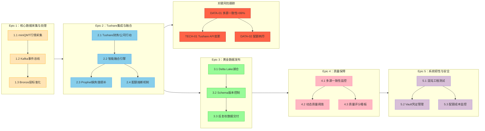

# Project Argus: 天枢计划

## 整合版项目待办事项看板 (Final Consolidated Backlog Kanban)

### 1. 看板概览与依赖关系 (Visual Overview)



### 2. 看板图例 (Kanban Legend)
*   **颜色编码**:
    *   <span style="color:#FFA500">■</span> **橙色**: 数据采集基础 (Epic 1)
    *   <span style="color:#1E90FF">■</span> **蓝色**: Tushare集成与融合 (Epic 2)
    *   <span style="color:#32CD32">■</span> **绿色**: 数据发布 (Epic 3)
    *   <span style="color:#FF69B4">■</span> **粉色**: 质量保障 (Epic 4)
    *   <span style="color:#9370DB">■</span> **紫色**: 系统韧性与安全 (Epic 5)
    *   <span style="color:#B22222">■</span> **红色**: 需重点关注的关键风险。
*   **关联关系**: 箭头表示逻辑上的依赖或数据流向。所有Epic最终都服务于质量保障和系统韧性。

---

### 3. 详细待办事项列表 (Detailed Backlog Cards)

#### Epic 1: 核心数据采集与基础处理

> #### **1.1. miniQMT行情采集 (通过独立的Windows QMT数据代理子项目)**
> **Prio:** 高 | **Status:** `To Do (Sprint 1)` | **Reqs:** `FR-001`, `BR-001`, `User Story 1.1`, `User Story 1.1.bis`
> **作为** 一名数据工程师，**我想要** Project Argus能通过一个独立部署的`Windows QMT数据代理`子项目稳定采集`miniQMT`的A股行情，**以便** 解耦平台依赖并为数据管道提供核心原始数据。
> **子任务 (Project Argus 范围):**
>    - [ ] **1.1.1:** 确认/更新 `qmt_collector.py` 中调用外部HTTP代理的逻辑，确保其健壮性和正确的错误处理。
>    - [ ] **1.1.2:** 验证 `qmt_collector.py` 能正确处理从代理返回的各种数据格式和可能的错误响应。
>    - [ ] **1.1.3:** 在 Project Argus 文档中（如 `Readme.md`, `system_design.md`）清晰说明对 `project-argus-qmt-agent` 子项目的依赖，并提供其仓库链接和基本配置指引（如环境变量设置）。
>    - [ ] **1.1.4:** 编写 Project Argus 与 `project-argus-qmt-agent` 集成的端到端测试场景描述（测试用例本身可能由QA或开发共同完成）。
> **验收标准 (Project Argus 范围):**
>    1. `qmt_collector.py`能通过配置的URL成功调用独立运行的`Windows QMT数据代理`服务。
>    2. Project Argus能正确处理和存储从代理获取的数据。
>    3. Project Argus文档清晰指引了如何设置和使用外部的QMT数据代理。
> **依赖外部项目:** `project-argus-qmt-agent` (https://github.com/jiaenyue/project-argus-qmt-agent) 必须已独立部署并成功运行。其自身的开发、部署和维护在其自己的项目范围内管理。

> #### **1.2. Kafka事件总线**
> **Prio:** 高 | **Status:** `To Do (Sprint 1)` | **Reqs:** `NFR-003`
> **作为** 一名系统架构师，**我想要** 通过`Apache Kafka`作为中央消息总线来解耦数据采集与处理层，**以便** 提升系统韧性，支持削峰填谷，并为未来向实时处理演进提供扩展能力。
> **验收标准:** 1. 所有原始数据被封装为标准事件发布到Kafka的`raw_data_topic`。 2. Kafka主题配置了适当的持久化策略。

> #### **1.3. Bronze层标准化**
> **Prio:** 高 | **Status:** `To Do (Sprint 1)` | **Reqs:** `FR-003`
> **作为** 一名数据工程师，**我想要** 实现一个消费Kafka原始数据的`Bronze`层处理器，**以便** 对来自不同源头的数据进行统一的格式化、去重和基础类型转换。
> **验收标准:** 1. 正确消费`raw_data_topic`。 2. 日期、股票代码格式统一。 3. 重复记录被剔除。

---

#### Epic 2: Tushare集成与融合

> #### **2.1. Tushare财务/公司行动**
> **Prio:** 高 | **Status:** `Product Backlog` | **Reqs:** `FR-002`, `BR-002`
> **作为** 一名量化分析师，**我想要** 系统能够从`Tushare Pro`获取财务指标、公司行动和分析师评级数据，**以便** 我可以构建更复杂的多因子模型。
> **验收标准:** 1. Tushare数据采集API的调用成功率 > 99.5%。 2. Gold层包含`pe_ttm`, `div_cash`等关键补充字段。

> #### **2.2. 智能融合引擎**
> **Prio:** 高 | **Status:** `To Do (Sprint 1)` | **Reqs:** `FR-004`
> **作为** 一名数据工程师，**我想要** 开发一个遵循“数据源优先级原则”的智能数据融合引擎，**以便** 能自动、正确地合并`miniQMT`和`Tushare Pro`的数据，并记录完整的数据血缘。
> **验收标准:** 1. 严格遵循`data_governance`文档中定义的优先级。 2. 融合后的每个关键字段都必须有一个伴随的`_source`字段。

> #### **2.3. Prophet缺失值填补**
> **Prio:** 中 | **Status:** `Product Backlog` | **Reqs:** `FR-006`
> **作为** 一名数据工程师，**我想要** 当核心字段在所有源中都缺失时，系统能自动触发`Prophet`模型进行预测填补，**以便** 最大化数据完整性。
> **验收标准:** 1. 系统实现了基于时间序列模型的预测填补能力。 2. 关键数值字段的最终缺失率在处理后低于0.1%。

> #### **2.4. 配额熔断机制**
> **Prio:** 高 | **Status:** `To Do (Sprint 1)` | **Reqs:** `FR-009`
> **作为** 一名DevOps工程师，**我想要** 一个基于`Redis`的分布式Tushare配额管理器，**以便** 主动避免因配额耗尽导致核心管道中断。
> **验收标准:** 1. 当配额使用率超过90%时，系统自动触发P1级告警。 2. 配额耗尽时，行情采集自动切换为仅使用`miniQMT`。

---

#### Epic 3: 黄金数据发布

> #### **3.1. Delta Lake湖仓**
> **Prio:** 高 | **Status:** `To Do (Sprint 1)` | **Reqs:** `TR-004`, `BR-001`
> **作为** 一名数据工程师，**我想要** 最终的Gold层数据以`Delta Lake`格式存储，**以便** 利用其ACID事务、时间旅行和Schema强制能力，从根本上保障数据的一致性和可靠性。
> **验收标准:** 1. 数据写入是原子性的。 2. 支持查询任意历史版本的数据。

> #### **3.2. Schema版本控制**
> **Prio:** 中 | **Status:** `Product Backlog`
> **作为** 一名量化分析师，**我想要** Gold层的数据Schema受到严格的版本控制，**以便** 保证Schema的稳定性和可预见性，防止我的策略代码失效。
> **验收标准:** 1. Schema定义文件被纳入Git版本控制。 2. 禁止在生产环境手动修改Schema。

> #### **3.3. 后复权数据交付**
> **Prio:** 高 | **Status:** `Product Backlog` | **Reqs:** `NFR-001`
> **作为** 一名量化交易员，**我想要** 在每日收盘后60分钟内获得当日的、经过后复权的“黄金标准”数据，**以便** 我能立即进行策略回测和信号验证。
> **验收标准:** 1. 端到端数据处理时间 < 60分钟。 2. 所有OHLC价格均为后复权价，复权逻辑经过严格验证。

---

#### Epic 4: 质量保障

> #### **4.1. 多源一致性监控**
> **Prio:** 高 | **Status:** `To Do (Sprint 1)` | **Reqs:** `FR-008`, `NFR-005`
> **作为** 一名数据质量分析师，**我想要** 当`miniQMT`与`Tushare`的收盘价差异持续超过0.5%时，系统能实时告警并自动隔离有问题的批次数据，**以便** 主动防止不一致的数据污染Gold层。
> **验收标准:** 1. 一致性比率在Grafana看板上实时展示。 2. 当比率持续低于99%时，触发P1级告警。 3. 不一致的数据批次被隔离。

> #### **4.2. 动态质量阈值**
> **Prio:** 中 | **Status:** `Product Backlog`
> **作为** 一名风控专员，**我想要** 在市场剧烈波动时，系统能自动放宽一致性检查的容忍度，**以便** 提高告警的信噪比。
> **验收标准:** 1. 质量决策引擎在执行校验时，会从配置中心获取或动态计算出当前应使用的阈值。

> #### **4.3. 质量评分看板**
> **Prio:** 高 | **Status:** `Product Backlog` | **Reqs:** `NFR-004`, `BR-003`
> **作为** 一名项目经理，**我想要** 系统能为每日产出的数据计算一个综合质量分，**以便** 我能用一个顶层核心指标来衡量和报告整个数据管道的健康度和可信度。
> **验收标准:** 1. 质量分数的计算严格遵循`quality_kpi.md`中定义的权重模型。 2. 月度平均质量分必须达到95分以上。

---

#### Epic 5: 系统韧性与安全

> #### **5.1. 混沌工程测试**
> **Prio:** 中 | **Status:** `Product Backlog` | **Reqs:** `BR-004`
> **作为** 一名DevOps工程师，**我想要** 每月定期执行混沌工程实验，**以便** 科学地、主动地验证系统的自动故障转移机制是否能按预期工作。
> **验收标准:** 1. 在模拟主数据源`miniQMT`故障后，系统能在2分钟内自动切换到`Tushare`。

> #### **5.2. Vault凭证管理 (原故事5.3)**
> **Prio:** 高 | **Status:** `To Do (Sprint 1)` | **Reqs:** `NFR-006`
> **作为** 一名安全官，**我想要** 所有的API Token都通过一个安全的凭证管理器（如Vault）进行管理，**以便** 杜绝任何形式的凭证硬编码。
> **验收标准:** 1. CI/CD流程中的安全扫描确保没有任何凭证被提交到代码库。

> #### **5.3. 配额成本监控 (原故事5.4)**
> **Prio:** 中 | **Status:** `Product Backlog`
> **作为** 一名项目经理，**我想要** 在Grafana仪表盘上有一个专门的面板来可视化Tushare积分的消耗趋势和云存储的成本，**以便** 我能主动进行成本管理和预算控制。
> **验收标准:** 1. Grafana展示Tushare配额的每日/每周消耗量。 2. 当成本或配额消耗超过预算的90%时，系统能自动发送告警。

---

### 4. 关键风险跟踪与缓解 (Key Risk Tracking)

| 风险ID | 风险描述 | 级别 | 核心缓解措施 (关联任务) |
| :--- | :--- | :--- | :--- |
| **DATA-01** | **多源数据一致性低于99%** | **关键** | **4.1** 多源一致性实时监控与隔离<br>**2.2** 智能融合引擎以主源为准 |
| **TECH-01** | **Tushare Pro API 发生不兼容变更** | **关键** | **2.1** 抽象`TushareAdapter`层，隔离变更<br>建立CI/CD契约测试 |
| **DATA-02** | **Tushare配额意外耗尽** | **关键** | **2.4** 配额熔断机制 (90%预警+自动切换)<br>**5.3** 配额成本监控看板 |

---

### 5. 下一步行动项 (Next Actions - Sprint 1)

1.  **立即启动 (P0 - 紧急):**
    *   [ ] **2.2 智能融合引擎开发:** 这是数据融合的核心，必须最先启动。
    *   [ ] **4.1 多源一致性监控:** 与融合引擎并行开发，确保产出数据质量可信。
    *   [ ] **5.2 Vault凭证管理:** 安全基础，所有API调用前必须完成。
2.  **高优先级 (P1):**
    *   [ ] **1.1 & 1.2 & 1.3 核心采集链路搭建:** 建立从QMT到Kafka再到Bronze层的完整数据流。
    *   [ ] **2.4 配额熔断机制:** 保障Tushare集成的稳定性。
    *   [ ] **3.1 Delta Lake湖仓搭建:** 为数据发布提供基础存储。
3.  **资源分配计划 (Gantt Chart):**
    ```mermaid
    gantt
       title Sprint 1 关键资源分配
       dateFormat  YYYY-MM-DD
       section 数据团队 (Data)
       融合引擎开发      :crit, 2023-11-01, 7d
       Tushare适配器   :2023-11-08, 5d
       
       section 质量团队 (DQA)
       一致性监控规则   :crit, 2023-11-01, 5d
       动态阈值模型     :2023-11-06, 3d
       
       section 平台团队 (DevOps/Platform)
       Vault凭证部署    :crit, 2023-11-01, 2d
       "Kafka & Redis部署" :2023-11-01, 3d
       Delta Lake环境  :2023-11-06, 3d
    ```

---

### Epic 6: (未来规划) AI集成与智能化扩展
> #### **6.1.调研xtquantai MCP模式与AI工具集成**
> **Prio:** 低 (未来) | **Status:** `Future Consideration`
> **作为** 一名系统架构师，**我想要** 调研`xtquantai`的MCP服务器模式与兼容AI工具（如Cursor）的集成可行性与效果，**以便** 评估未来通过AI助手直接操控QMT或进行数据分析的潜力。
> **子任务:**
>    - [ ] **6.1.1:** 学习MCP协议基本原理和`xtquantai`的MCP实现。
>    - [ ] **6.1.2:** 在测试环境尝试部署`xtquantai`为MCP服务器。
>    - [ ] **6.1.3:** 测试与至少一种AI工具（如Cursor）的连接和基本交互。
>    - [ ] **6.1.4:** 撰写调研报告，总结可行性、优缺点及潜在应用场景。
> **验收标准:** 1. 完成`xtquantai` MCP模式的基本测试。 2. 输出一份包含可行性分析和未来建议的调研报告。

> #### **6.2. (可选) 实现AI助手查询QMT数据PoC**
> **Prio:** 低 (未来) | **Status:** `Future Consideration` | **Depends on:** `6.1`
> **作为** 一名高级量化分析师，**我想要** 一个通过AI助手查询QMT数据的原型验证(PoC)，**以便** 体验和评估AI辅助数据获取的便捷性。
> **验收标准:** 1. PoC能演示通过AI工具成功执行至少三种QMT数据查询。 2. 查询结果能在AI工具中正确展示。