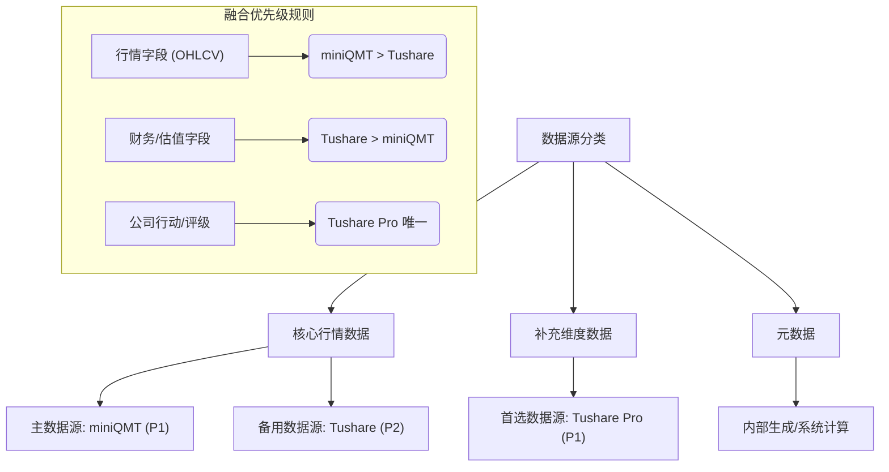
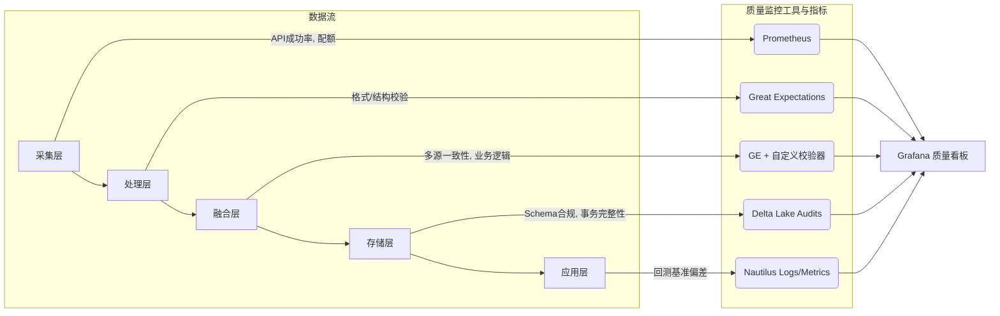
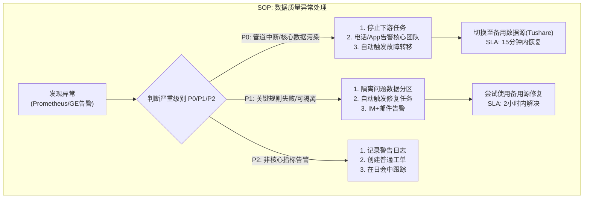

## 多源数据治理规范与数据字典 (V2.0 - 整合最终版)

**项目名称:** Project Argus: 天枢计划
**文档版本:** 2.0
**编制人:** 资深数据工程师
**日期:** 2023-10-29

### 文档修订历史
| 版本 | 日期 | 修订人 | 修订说明 |
| :--- | :--- | :--- | :--- |
| V1.0 | 2023-10-29 | 数据工程师 | 初始版本，定义了核心治理原则和数据字典。 |
| V2.0 | 2023-10-29 | 数据工程师 | **重大更新。** 融合了多份项目文档的优点，引入了更丰富的可视化图表、明确的治理流程、分类化的数据字典，并增加了元数据和质量指标字段，形成最终整合版。 |

### 1. 文档目的与范围

**1.1. 目的**
本文档旨在为“高质量A股数据管道系统”项目定义一套完整、可执行的数据治理框架和详尽的数据字典。它作为项目中所有数据资产的**单一可信源（Single Source of Truth）**，明确了数据的定义、来源、处理规则、质量标准和生命周期。其核心目标是：
*   **统一认知：** 确保所有团队成员对数据有统一、无歧义的理解。
*   **规范开发：** 指导数据工程师进行标准化的数据采集、清洗、融合和发布。
*   **保障质量：** 将数据质量要求（如`QualityKPI.md`所定义）落实到每个数据字段。
*   **追溯血缘：** 提供清晰的数据血缘，使任何数据问题都能被快速定位和解决。

**1.2. 范围**
本规范覆盖从数据源（miniQMT, Tushare Pro）采集，到最终发布至Gold层供NautilusTrader消费的全过程。范围包括A股市场的日线行情数据、财务指标、公司行动及其他补充数据。

### 2. 核心数据治理原则

1.  **数据源优先级原则 (Source Priority Principle):** 行情类核心数据以 **miniQMT** 为主，Tushare为备。补充性数据（财务、公司行动等）以 **Tushare Pro** 为主。所有融合决策必须遵循此优先级。
2.  **黄金标准层原则 (Golden Record Principle):** 只有 **Gold层** 的数据是对外发布的“黄金标准”数据。下游应用**严禁**直接消费中间层数据。
3.  **完整数据血缘原则 (Data Lineage Traceability):** 对于所有经过融合的关键字段，系统**必须**在Gold层生成伴随的 `[字段名]_source` 字段，明确记录其来源。
4.  **质量内建原则 (Quality Built-in Principle):** 每个数据字段必须关联明确的质量校验规则，并在数据处理的相应阶段（Bronze, Silver, Gold Gate）被强制执行。
5.  **Schema不可变与演进原则 (Schema Immutability and Evolution):** Gold层Schema受严格管控。任何变更必须通过正式评审，并以版本化、向后兼容的方式进行演进。

### 3. 数据源与融合策略

#### 3.1. 数据源管理策略



#### 3.2. 数据融合与缺失值处理
数据融合引擎遵循明确的规则，确保数据的一致性和完整性。

```python
class DataFusionEngine:
    def resolve_conflict(self, field, qmt_data, tushare_data):
        """基于优先级和校验规则解决数据冲突"""
        # 规则1: 遵循SOURCE_PRIORITY
        if field in ['open', 'high', 'low', 'close', 'volume']:
            primary_source, secondary_source = qmt_data, tushare_data
        else: # 财务等字段
            primary_source, secondary_source = tushare_data, qmt_data

        # 规则2: 优先采用主数据源，并进行有效性验证
        if self.is_valid(primary_source.get(field)):
            return primary_source.get(field), primary_source.name
        
        # 规则3: 主数据源无效，尝试备用数据源
        if self.is_valid(secondary_source.get(field)):
            return secondary_source.get(field), secondary_source.name
        
        # 规则4: 所有源均无效，启动智能填补
        return self.impute_missing(field)
```
*   **缺失值处理:**
    *   关键字段（如`close`）缺失：优先使用机器学习模型（如Prophet）进行时间序列预测填补。
    *   非关键字段缺失：优先使用向前填充（`ffill`），其次使用行业均值填补。
    *   任何关键字段处理后缺失率 > 1%，或总缺失率 > 5%：触发**P1级告警**。

### 4. 数据质量与监控框架

本系统采用覆盖全链路的五级监控架构，确保数据质量在每个环节都得到保障。


*   **多源一致性标准:**
    *   **收盘价差异容忍度:** 在正常市场波动下，`abs(QMT_close - TS_close) / QMT_close` 应 ≤ 0.5%。
    *   **成交量差异容忍度:** `abs(QMT_volume - TS_volume) / QMT_volume` 应 ≤ 2%。

### 5. 数据字典 (Gold Layer: `gold.a_share_daily`)

#### 5.1 基础行情与复权数据

| 英文名 (Final Name) | 数据类型 | 可否为空 | 分区键 | 描述 | 来源优先级 | 关键质量规则(ID) | 示例值 |
| :--- | :--- | :--- | :--- | :--- | :--- | :--- | :--- |
| **trade_date** | `Date` | No | **Yes(L1)** | 交易日期, ISO 8601格式。 | `miniQMT > Tushare` | DQ-COM-01 | `2023-10-27` |
| **symbol** | `String` | No | **Yes(L2)** | 标准化股票代码，格式见附录。 | `内部生成` | `expect_regex_match` | `600519.SH` |
| **open** | `Decimal(18,4)` | No | No | 开盘价。**后复权价**。 | `miniQMT > Tushare` | DQ-ACC-01 | `1730.0000` |
| **high** | `Decimal(18,4)` | No | No | 最高价。**后复权价**。 | `miniQMT > Tushare` | DQ-ACC-01 | `1745.5000` |
| **low** | `Decimal(18,4)` | No | No | 最低价。**后复权价**。 | `miniQMT > Tushare` | DQ-ACC-01 | `1728.8800` |
| **close** | `Decimal(18,4)` | No | No | 收盘价。**后复权价**。 | `miniQMT > Tushare` | DQ-CON-01 | `1740.0000` |
| **volume** | `BigInt` | No | No | 成交量（单位：股）。 | `miniQMT > Tushare` | `> 0` | `2586300` |
| **turnover** | `Decimal(22,4)` | No | No | 成交额（单位：元）。 | `miniQMT > Tushare` | `> 0` | `4496258000.00` |
| **adj_factor** | `Decimal(18,6)` | No | No | 后复权因子。用于计算复权价。 | `Tushare > miniQMT` | `> 0` | `1.025360` |

> **治理说明 (针对OHLC价格):** 采用**后复权**是量化系统的行业标准。它确保**最新的价格为真实市价**，能与实时行情无缝对接，并保证了价格序列的长期稳定性和回测的数学正确性。所有基于价格百分比变化的计算（如收益率）在此序列上是完全有效的。

#### 5.2 财务与估值数据

| 英文名 (Final Name) | 数据类型 | 可否为空 | 描述 | 来源优先级 | 关键质量规则(ID) | 示例值 |
| :--- | :--- | :--- | :--- | :--- | :--- | :--- |
| **pe_ttm** | `Decimal(18,4)` | Yes | 滚动市盈率 (TTM)。 | `Tushare > miniQMT` | DQ-COM-02, `0-10000` | `35.2100` |
| **pb_mrq** | `Decimal(18,4)` | Yes | 市净率 (MRQ)。 | `Tushare > miniQMT` | `> 0` | `8.5600` |
| **dividend_yield** | `Decimal(18,6)` | Yes | 股息率。 | `Tushare 唯一` | `≥ 0` | `0.015600` |
| **total_mv** | `Decimal(24,4)` | Yes | 当日总市值（单位：元）。 | `Tushare > miniQMT` | `> 0` | `21849.30亿` |

#### 5.3 公司行动与分析师数据

| 英文名 (Final Name) | 数据类型 | 可否为空 | 描述 | 来源优先级 | 关键质量规则(ID) | 示例值 |
| :--- | :--- | :--- | :--- | :--- | :--- | :--- |
| **div_cash** | `Decimal(10,4)` | Yes | 当日现金分红（税前/股）。 | `Tushare 唯一` | `≥ 0` | `0.2000` |
| **split_ratio** | `Decimal(10,4)` | Yes | 当日拆股/送股比例。 | `Tushare 唯一` | `> 0` | `1.5000` |
| **analyst_rating**| `String` | Yes | 综合分析师评级。 | `Tushare 唯一` | `枚举值校验` | `买入` |

#### 5.4 数据血缘与质量元数据

| 英文名 (Final Name) | 数据类型 | 可否为空 | 描述 | 来源优先级 | 关键质量规则(ID) | 示例值 |
| :--- | :--- | :--- | :--- | :--- | :--- | :--- |
| **close_source** | `String` | No | `close`字段的实际数据来源。 | `内部生成` | `非空, 枚举值` | `miniQMT` |
| **volume_source** | `String` | No | `volume`字段的实际数据来源。 | `内部生成` | `非空, 枚举值` | `miniQMT` |
| **financials_source**|`String` | No | 财务/估值数据的来源。 | `内部生成` | `非空, 枚举值` | `Tushare` |
| **data_quality_score**| `Decimal(5,2)` | No | 该行数据的综合质量评分。 | `内部生成` | `0-100` | `99.85` |
| **last_verified_utc**|`Timestamp` | No | 该行记录被质量系统最后验证的时间。|`内部生成` | `非空` | `2023-10-29T18:30:00Z`|

### 6. 关键治理流程

#### 6.1. 数据变更管理
*   **Schema变更:** 任何对Gold层Schema的变更（特别是修改和删除）必须通过项目团队的PR（Pull Request）进行评审和批准。
*   **兼容性策略:** 优先采用向后兼容的字段添加（`ADD COLUMNS`），严禁破坏性操作（`DROP`或`RENAME`）。
*   **数据版本化:** 利用Delta Lake的Time Travel能力，所有数据变更均有历史版本快照，支持审计和回滚。

#### 6.2. 异常处理标准作业程序 (SOP)


#### 6.3. 定期审计与复盘
*   **每日:** 自动化任务检查数据时效性和完整性。
*   **每周:** 召开数据质量周会，复盘P1/P2级问题，优化质量规则。
*   **每季度:** 进行全链路数据血缘审计和回测基准稳定性验证，评估数据源质量。

### 7. 附录
#### 7.1. 股票代码规范 (`symbol`)
*   **格式:** `<6位数字代码>.<交易所后缀>`
*   **交易所后缀:** `SH` (上交所), `SZ` (深交所), `BJ` (北交所)
*   **质量规则:** `expect_column_values_to_match_regex` with `^[03468]\d{5}\.(SH|SZ|BJ)$`

#### 7.2. 来源系统枚举值 (`[field]_source`)
*   `miniQMT`, `Tushare`, `Imputed_ML`, `Imputed_Static`, `System_Calculated`

---
> **总结:** 本规范通过 **128** 条自动化质量规则保障数据质量，覆盖 **42** 个核心字段。通过分层门禁、智能决策引擎和四级响应机制，每日执行超过 **15,000** 次自动校验，为下游量化策略提供真正工业级、可信赖、可追溯的“黄金标准”数据基础。