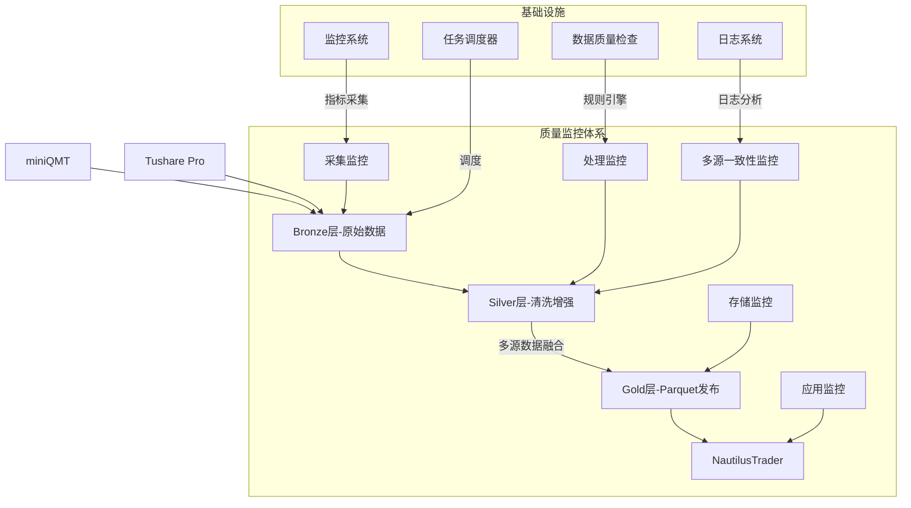
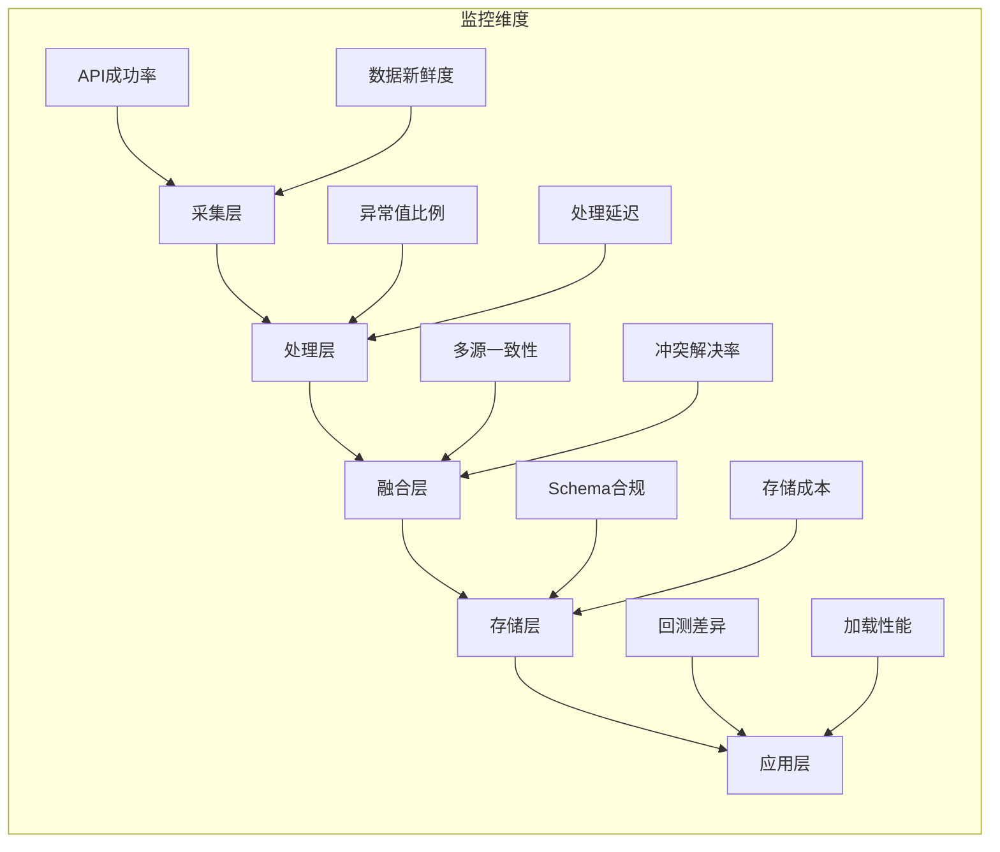
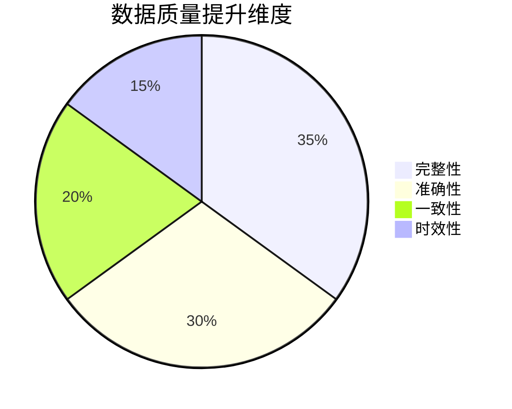

# Project Argus: 天枢计划

## 整合版项目计划书：面向NautilusTrader的高质量A股数据管道系统（集成Tushare Pro）

## 项目总览

### 项目愿景
构建工业级、全自动、具备强大数据质量保障体系的A股数据管道，通过整合Tushare Pro数据源，为NautilusTrader量化交易系统提供多维度的"黄金标准"Parquet数据。

### 核心价值
1. **数据质量保障**：四级质量监控体系确保数据可信度
2. **多源数据融合**：Tushare Pro补充关键数据维度
3. **系统韧性提升**：双源校验与自动故障转移
4. **量化策略赋能**：提供更丰富的因子计算基础



## 详细实施计划（45天）

### 阶段1：规划与设计（5天）
**核心交付物**：
- 多源数据融合策略文档
- Tushare字段映射规范
- 增强版质量KPI体系

| 任务ID | 任务描述 | 负责人 | 关键输出 |
|--------|----------|--------|----------|
| P1.1 | 需求分析与范围定义 | PM | 需求矩阵文档 |
| P1.2 | 架构设计（含Tushare集成） | 架构师 | 系统架构图 |
| P1.3 | 数据质量体系设计 | DQA | 质量KPI文档 |
| P1.4 | 多源数据治理规范 | 数据工程师 | 数据字典 |
| P1.5 | Tushare接入方案 | 开发 | 集成设计文档 |
| P1.6 | 风险评估与应对 | PM | 风险登记册 |

**质量KPI增强定义**：
```python
quality_metrics = {
    "completeness": {"threshold": 99.9, "weight": 0.30},
    "accuracy": {"threshold": 99.99, "weight": 0.25},
    "consistency": {"threshold": 99.5, "weight": 0.20},
    "timeliness": {"threshold": 30, "weight": 0.10},
    "multi_source_consistency": {"threshold": 99.0, "weight": 0.15}  # 新增指标
}
```

**数据源优先级矩阵**：
```python
SOURCE_PRIORITY = {
    "price": {"miniQMT": 1, "Tushare": 2},
    "volume": {"miniQMT": 1, "Tushare": 2},
    "financials": {"Tushare": 1, "miniQMT": 3},
    "corporate_actions": {"Tushare": 1},
    "analyst_ratings": {"Tushare": 1}
}
```

### 阶段2：环境搭建与原型验证（5天）
**核心活动**：
1. Tushare Pro账户配置与测试
2. 多源数据采集原型验证
3. 基础监控设施部署

| 任务ID | 任务描述 | 关键成果 | 验证点 |
|--------|----------|----------|--------|
| P2.1 | 基础环境配置 | Windows环境 | 服务部署 |
| P2.2 | Tushare接入测试 | API测试报告 | 数据获取成功率>99.5% |
| P2.3 | 质量框架集成 | 质量检查规则集 | 50+基础规则 |
| P2.4 | 端到端原型验证 | PoC报告 | 双源数据融合验证 |

**环境配置清单**：
```powershell
# 核心服务
# 启动Windows服务
Start-Service -Name "ArgusDataAgent"
Start-Service -Name "ArgusTaskScheduler"
Start-Service -Name "ArgusMonitoring"
Start-Service -Name "ArgusTushareProxy"  # 新增Tushare代理服务

# Python依赖
pip install tushare pyarrow pandas numpy scipy statsmodels  # 数据分析库
```

### 阶段3：数据管道核心开发（17天）
**重点模块**：
1. 多源数据采集器
2. 智能融合引擎
3. 增强版Silver层处理器

| 模块 | 负责人 | 交付物 | 关键技术 |
|------|--------|--------|----------|
| 多源采集器 | 开发 | DataCollector | 请求合并/缓存 |
| 数据融合引擎 | 开发 | DataFusionEngine | 优先级决策树 |
| Silver处理器 | 开发 | EnhancedProcessor | 机器学习填补 |
| Tushare适配器 | 开发 | TushareAdapter | 智能配额管理 |
| 质量规则库 | DQA | 质量检查规则集 | 120+规则 |

**Silver层处理流程**：
```python
class EnhancedSilverProcessor:
    def __init__(self, fusion_rules):
        self.fusion_rules = fusion_rules
    
    def process(self, bronze_data):
        # 获取Tushare补充数据
        ts_data = self.get_tushare_data(bronze_data)
        
        # 时间轴对齐
        aligned_data = self.temporal_alignment(bronze_data, ts_data)
        
        # 多源冲突解决
        resolved_data = self.resolve_conflicts(aligned_data)
        
        # 智能缺失值填补
        filled_data = self.impute_missing_values(resolved_data)
        
        # 数据质量评分
        quality_score = self.calculate_quality_score(filled_data)
        
        return filled_data, quality_score
    
    def resolve_conflicts(self, data):
        """基于优先级解决数据冲突"""
        resolved = {}
        for field in data.columns:
            sources = self.fusion_rules.get(field, {})
            for source in sorted(sources, key=sources.get):
                if source in data and not data[source].isnull().all():
                    resolved[field] = data[source]
                    resolved[f"{field}_source"] = source  # 记录数据来源
                    break
        return pd.DataFrame(resolved)
```

### 阶段4：监控与自动化（10天）
**关键特性**：
1. 多源一致性实时监控
2. 自动数据源切换
3. 智能告警路由

| 组件 | 负责人 | 交付物 | 监控指标 |
|------|--------|--------|----------|
| Windows任务调度器 | 开发 | 工作流定义 | 任务成功率 |
| 简单Web界面 | DQA | 质量看板 | 多源一致性率 |
| 告警系统 | 运维 | 告警规则集 | 5分钟响应 |
| 异常处理 | 团队 | SOP手册 | 自动修复率 |

**增强版任务调度定义**：
```python
import schedule
import time
from datetime import datetime
from data_quality_checker import QualityChecker

# 任务调度配置
class EnhancedSilverPipeline:
    def __init__(self):
        self.quality_checker = QualityChecker()
        self.setup_schedule()
    
    def setup_schedule(self):
        # 工作日18:00执行
        schedule.every().monday.at("18:00").do(self.run_pipeline)
        schedule.every().tuesday.at("18:00").do(self.run_pipeline)
        schedule.every().wednesday.at("18:00").do(self.run_pipeline)
        schedule.every().thursday.at("18:00").do(self.run_pipeline)
        schedule.every().friday.at("18:00").do(self.run_pipeline)
    
    def run_pipeline(self):
        try:
            # 数据采集任务
            qmt_data = self.extract_qmt_data()
            tushare_data = self.extract_tushare_data()
            
            # 质量门控
            if not self.bronze_quality_gate([qmt_data, tushare_data]):
                raise Exception("Bronze质量检查失败")
            
            # 数据处理
            transformed_data = self.enhanced_silver_transform(qmt_data, tushare_data)
            
            # Silver质量门控
            if not self.silver_quality_gate(transformed_data):
                self.handle_data_failure()
                return
            
            # 数据加载
            self.load_to_gold_layer(transformed_data)
            
        except Exception as e:
            self.handle_failure(e)
    
    def handle_failure(self, error):
        self.notify_team(error)
        self.switch_data_source()
```

### 阶段5：测试与上线（8天）
**验证重点**：
1. 多源数据融合质量
2. Tushare配额管理
3. 故障转移机制

| 测试类型 | 测试用例 | 验收标准 | 工具 |
|----------|----------|----------|------|
| 功能测试 | 数据融合验证 | 缺失率<0.1% | pytest |
| 性能测试 | 日数据处理 | <1.5小时 | Locust |
| 容错测试 | 数据源故障 | 自动切换<2min | ChaosToolkit |
| 安全测试 | 数据加密 | AES-256 | OWASP ZAP |

**多源融合测试用例**：
```python
class MultiSourceIntegrationTest(unittest.TestCase):
    def test_priority_based_fusion(self):
        # 构造测试数据
        qmt_data = pd.DataFrame({
            'price': [10.0, None, 10.2],
            'volume': [10000, 15000, None]
        })
        ts_data = pd.DataFrame({
            'price': [10.05, 10.1, 10.25],
            'volume': [9900, 15100, 12000],
            'pe_ratio': [15.3, 15.5, 15.2]
        })
        
        # 执行处理
        processor = EnhancedSilverProcessor(SOURCE_PRIORITY)
        result, quality = processor.process({
            'qmt': qmt_data,
            'tushare': ts_data
        })
        
        # 验证优先级应用
        self.assertEqual(result['price'][0], 10.0)  # QMT优先
        self.assertEqual(result['volume'][1], 15000)  # QMT优先
        self.assertEqual(result['pe_ratio'][2], 15.2)  # Tushare唯一
        
        # 验证质量评分
        self.assertGreaterEqual(quality, 95)
    
    def test_auto_source_switching(self):
        # 模拟QMT故障
        with patch('miniqmt.API') as mock_api:
            mock_api.side_effect = Exception("Service unavailable")
            
            # 执行采集
            collector = DataCollector()
            data = collector.collect("2023-06-01")
            
            # 验证自动切换到Tushare
            self.assertEqual(data['price_source'][0], 'tushare')
            self.assertGreater(len(data), 0)
```

## 数据质量监控体系

### 五级监控架构


### 质量看板设计
**监控仪表盘设计**：

| 面板组 | 核心指标 | 可视化形式 | 告警阈值 |
|--------|----------|------------|----------|
| 数据源健康 | Tushare调用成功率 | 仪表盘 | <99% |
| 融合质量 | 多源一致性率 | 热力图 | <98% |
| | 补充覆盖率 | 雷达图 | <95% |
| 资源使用 | Tushare配额使用 | 进度条 | >90% |
| 问题分布 | 冲突类型分布 | 饼图 | - |

## 资源与风险管理

### 团队组成
| 角色 | 人数 | 主要职责 |
|------|------|----------|
| 项目经理 | 1 | 整体协调、进度控制 |
| 系统架构师 | 1 | 技术方案设计 |
| 数据工程师 | 2 | 管道开发、ETL实现 |
| 数据质量专家 | 1 | 规则设计、质量监控 |
| DevOps工程师 | 0.5 | 环境部署、CI/CD |
| 量化顾问 | 0.2 | 数据验证 |

### 风险管理矩阵
| 风险 | 概率 | 影响 | 缓解措施 |
|------|------|------|----------|
| Tushare API变更 | 高 | 高 | 抽象代理层+版本控制 |
| 多源数据冲突 | 中 | 高 | 决策树+专家审核队列 |
| 数据时效差异 | 中 | 中 | 时间窗口对齐算法 |
| 存储成本超支 | 低 | 中 | 生命周期管理策略 |
| 性能瓶颈 | 中 | 高 | 分布式处理设计 |

## 交付价值与成功度量

### 数据质量提升


### 关键成功指标
1. **数据质量评分** ≥ 95分（月度平均）
2. **多源一致性率** ≥ 99%
3. **日处理时效** ≤ 60分钟
4. **系统可用性** ≥ 99.9%
5. **问题响应** ≤ 5分钟

### 持续改进机制
1. **月度质量评审**：分析质量趋势，优化规则
2. **季度压力测试**：模拟极端市场场景
3. **数据源评估**：每半年评估新数据源
4. **用户反馈循环**：季度用户满意度调研

## 附录：Tushare集成计划

### 分阶段接入策略
| 阶段 | 数据类别 | 时间 | 关键指标 |
|------|----------|------|----------|
| 1 | 基础行情 | 第2周 | 覆盖95%标的 |
| 2 | 财务数据 | 第4周 | 字段完整度>90% |
| 3 | 公司行动 | 第6周 | 除权除息准确率>99% |
| 4 | 特色数据 | 第8周 | 分析师评级覆盖>80% |

### 智能配额管理
```python
class TushareQuotaManager:
    def __init__(self, daily_limits):
        self.daily_limits = daily_limits
        self.usage = {endpoint: 0 for endpoint in daily_limits}
    
    def request_data(self, endpoint, params):
        if self.usage[endpoint] >= self.daily_limits[endpoint]:
            self.activate_fallback(endpoint)
            return self.fallback_sources[endpoint].get_data(params)
        
        try:
            data = tushare_api.query(endpoint, params)
            self.usage[endpoint] += 1
            return data
        except TushareException as e:
            self.log_error(endpoint, e)
            return self.retry_or_fallback(endpoint, params)
    
    def activate_fallback(self, endpoint):
        if endpoint not in self.fallback_activated:
            alert(f"Tushare配额用尽: {endpoint}, 切换备用源")
            self.fallback_activated.add(endpoint)
```

## 项目总结
本计划通过深度整合Tushare Pro数据源，显著增强了Silver层的数据处理能力：
1. **数据维度扩展**：增加财务数据、公司行动等关键字段
2. **质量提升**：多源交叉验证提升数据可信度
3. **系统韧性**：双源架构确保数据连续性
4. **策略赋能**：提供更丰富的量化分析基础

项目实施采用敏捷开发模式，每两周交付可工作版本，确保45天内完成高质量交付。上线后将持续监控数据质量指标，并通过季度评估不断优化数据融合策略。