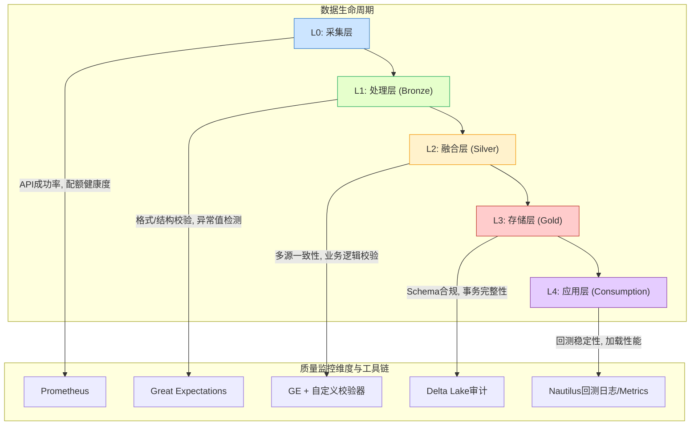
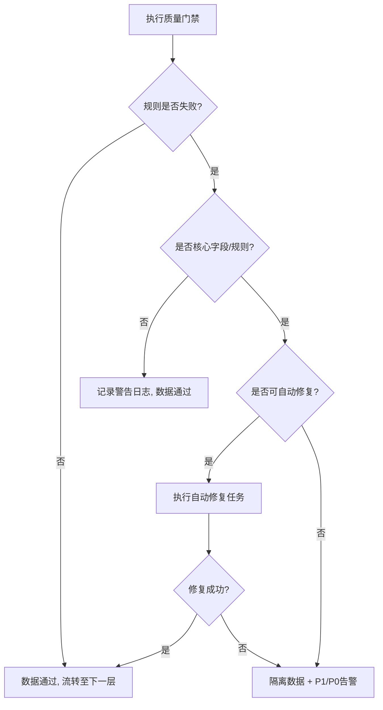
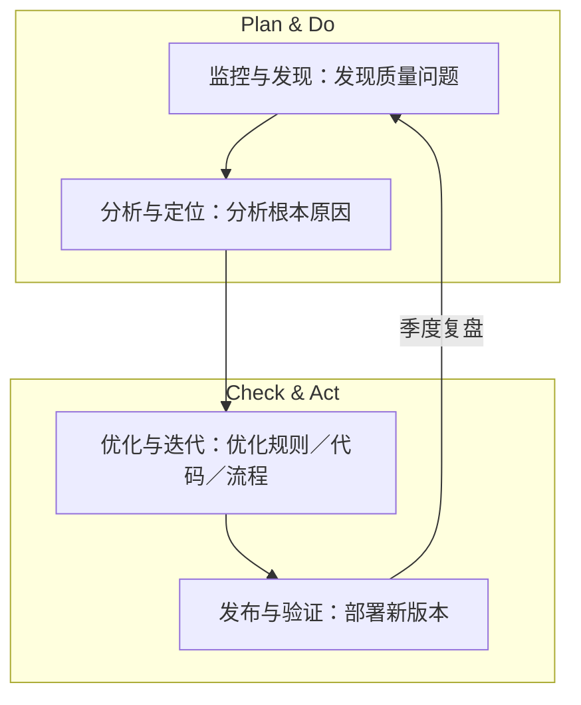

## 整合版数据质量体系设计文档 (质量KPI文档)

**项目名称:** Project Argus: 天枢计划
**文档版本:** 2.0 (整合最终版)
**编制人:** 数据质量专家 (DQA)
**日期:** 2023-10-28

### 1. 文档目的与质量哲学

**1.1. 文档目的**

本文档旨在为“高质量A股数据管道系统”项目定义一个全面的、可度量的、自动化的数据质量（DQ）保障体系。其核心目的在于将模糊的“高质量”概念转化为一系列明确、可衡量的关键绩效指标（KPI），并将质量保障内建于数据生命周期的每一个环节，以驱动开发、指导运营、支撑决策，最终确保交付给NautilusTrader的数据达到“黄金标准”。

**1.2. 核心质量哲学**

本体系建立在以下五大核心原则之上：

1.  **分层治理 (Layered Governance):** 在数据管道的每一层（采集、处理、融合、存储、应用）设立独立的质量门禁，问题发现越早，修复成本越低。
2.  **质量即代码 (Quality as Code):** 所有数据质量规则、期望和测试均以代码形式（如Great Expectations的JSON/Python）进行版本控制，确保一致性、可复现性和自动化。
3.  **主动监控，而非被动响应 (Proactive Monitoring):** 通过实时指标监控（Prometheus）、可视化看板（Grafana）和主动告警（Alertmanager），在数据问题影响下游业务前发现并处理它。
4.  **信任但验证 (Trust but Verify):** 任何数据源，无论主次，都必须经过交叉验证。**多源一致性**是本体系的信任基石和核心特色。
5.  **质量决策自动化 (Automated Quality Gating):** 引入**智能质量决策引擎（QDE）**，根据预设规则和动态阈值，自动决定数据流转（通过、隔离、修复或告警），最大化效率与可靠性。

### 2. 五级质量监控架构

本体系覆盖数据处理全生命周期，通过集成的工具链实现端到端监控。



### 3. 核心质量KPI框架

#### 3.1 质量维度定义

| 维度 | 定义 | 核心关联需求 |
| :--- | :--- | :--- |
| **完整性 (Completeness)** | 数据在记录级和字段级的缺失程度。 | FR-004, FR-006 |
| **准确性 (Accuracy)** | 数据与真实世界或权威来源的符合程度。 | BR-003, FR-004 |
| **一致性 (Consistency)** | 数据在不同系统或记录间的逻辑自洽性，本项目特指**多源一致性**。 | BR-002, FR-008, NFR-005 |
| **及时性 (Timeliness)** | 数据从产生到可用的延迟。 | NFR-001 |
| **唯一性 (Uniqueness)** | 确保主键或唯一标识符没有重复。 | FR-003 |
| **有效性 (Validity)** | 数据是否符合预定义的格式、类型或范围。 | FR-007 |

#### 3.2 综合质量评分模型

**综合质量分数 = Σ(维度得分 × 权重)**，旨在提供一个顶层的数据可信度快照。

```python
# 评分权重与目标
QUALITY_WEIGHTS = {
    "completeness": 0.30,
    "accuracy": 0.25,
    "consistency": 0.20,  # 包含多源一致性
    "timeliness": 0.15,
    "validity_uniqueness": 0.10
}
TARGET_SCORE = 95.0  # 关联 NFR-004
```
**评分标准**：
*   **≥ 95分：** 质量优秀 (Excellent / Green)
*   **85-94分：** 质量合格 (Acceptable / Yellow)
*   **< 85分：** 质量事故 (Incident / Red)

### 4. 分层质量门禁设计 (Quality Gates)

#### 4.1 L1: 处理层门禁 (Bronze Gate)
*   **目的**：确保进入数据湖的原始数据结构正确、基本完整。
*   **示例规则 (Great Expectations)**:
    ```json
    {
      "expectation_suite_name": "bronze_raw_data_suite",
      "expectations": [
        {"expectation_type": "expect_table_row_count_to_be_between", "kwargs": {"min_value": 4800, "max_value": 5500}},
        {"expectation_type": "expect_column_to_exist", "kwargs": {"column": "symbol"}},
        {"expectation_type": "expect_column_values_to_not_be_null", "kwargs": {"column": "close_price"}},
        {"expectation_type": "expect_column_values_to_be_in_set", "kwargs": {"column": "exchange", "value_set": ["SSE", "SZSE"]}}
      ]
    }
    ```

#### 4.2 L2: 融合层门禁 (Silver Gate)
*   **目的**：确保数据在融合后逻辑正确、多源一致、无异常值。
*   **示例规则 (Great Expectations)**:
    ```json
    {
      "expectation_suite_name": "silver_fused_data_suite",
      "expectations": [
        {"expectation_type": "expect_column_pair_values_A_to_be_greater_than_B", "kwargs": {"column_A": "high", "column_B": "low", "or_equal": true}},
        {"expectation_type": "expect_column_values_to_be_within_n_std_devs", "kwargs": {"column": "turnover_rate", "n_std_devs": 4}},
        {"expectation_type": "expect_custom_multi_source_consistency", "kwargs": {"column_a": "close_qmt", "column_b": "close_tushare", "relative_tolerance": 0.005, "mostly": 0.99}}
      ]
    }
    ```

#### 4.3 L3: 存储层门禁 (Gold Gate)
*   **目的**：确保最终发布的“黄金数据”Schema合规、分区正确、可供消费。
*   **示例规则 (Great Expectations / Delta Lake Checks)**:
    ```json
    {
      "expectation_suite_name": "gold_publishable_suite",
      "expectations": [
        {"expectation_type": "expect_table_columns_to_match_ordered_list", "kwargs": {"column_list": ["date", "symbol", "open", "high", "low", "close", "volume", "pe_ratio", "..."]}},
        {"expectation_type": "expect_column_values_to_match_regex", "kwargs": {"column": "symbol", "regex": "^[0368]\\d{5}\\.(SH|SZ)$"}},
        {"expectation_type": "expect_delta_table_has_no_uncompacted_files", "kwargs": {"max_uncompacted_files": 10}}
      ]
    }
    ```

### 5. 智能质量决策引擎 (QDE)

QDE是质量体系的大脑，它执行质量门禁并根据结果和策略进行智能决策。

#### 5.1 决策逻辑矩阵


#### 5.2 动态阈值调整
为适应市场极端情况，关键阈值可动态调整。
```python
def get_dynamic_consistency_threshold(market_volatility_index: float) -> float:
    """根据市场波动率动态调整多源一致性检查的容忍度。"""
    base_tolerance = 0.005  # 基础容忍度: 0.5%
    if market_volatility_index > 0.03:  # 当日市场平均波幅 > 3%
        return base_tolerance * 1.5  # 放宽至 0.75%
    elif market_volatility_index > 0.05: # 极端行情
        return base_tolerance * 2.0 # 放宽至 1.0%
    return base_tolerance
```

### 6. 数据质量可观测性 (Observability)

#### 6.1 Grafana质量主看板设计
| 面板组 | 核心指标 | 可视化形式 | 刷新频率 |
| :--- | :--- | :--- | :--- |
| **概览 & 评分** | **综合质量分 (今日/7日趋势)** | 单值大数字 & 折线图 | 30min |
| **数据源健康** | API成功率 (QMT/Tushare) | 仪表盘 | 1min |
| | Tushare配额使用率 | 进度条 | 5min |
| **管道时效性** | 端到端处理延迟 | 时间序列图 | 每日 |
| **核心质量维度** | 多源一致性率 (分板块) | 热力图 | 1h |
| | 关键字段完整性 | 条形图 | 1h |
| | Tushare补充覆盖率 | 雷达图 | 每日 |
| **问题洞察** | 近24小时告警列表 | 表格 | 1min |
| | 质量规则失败分布 | 饼图 | 1h |

#### 6.2 告警规则示例 (Prometheus/Alertmanager)
```yaml
- alert: CriticalMultiSourceConsistencyDrop
  expr: avg_over_time(dq_multisource_consistency_ratio[15m]) < 0.99
  for: 5m
  labels:
    severity: critical
  annotations:
    summary: "多源数据一致性严重下降 (值: {{ $value }})"
    description: "主备数据源 (QMT/Tushare) 收盘价在过去15分钟内一致性低于99%，请立即排查！"
```

### 7. 质量治理与响应机制

#### 7.1 四级响应策略 (SLA)
| 级别 | 触发条件 | 响应动作 | 解决时限 (SLA) |
| :--- | :--- | :--- | :--- |
| **P0 (Blocker)** | 管道中断；核心数据(收盘价)缺失 > 5% | 1. 立即停止下游任务<br>2. 自动触发故障转移<br>3. 电话/App告警核心团队 | ≤ 15分钟 |
| **P1 (Critical)** | 综合质量分 < 85；核心规则失败且无法自愈 | 1. 隔离问题数据<br>2. 邮件+IM告警<br>3. 自动创建高优工单 | ≤ 2小时 |
| **P2 (Major)** | 非核心规则失败；单一指标突破警告阈值 | 1. 日志记录并告警到频道<br>2. 生成普通工单 | ≤ 24小时 |
| **P3 (Minor)** | 数据轻微漂移；收到低优质量预警 | 1. 加入监控列表<br>2. 在周会中评审 | ≤ 7个工作日 |

#### 7.2 持续改进循环 (PDCA)


### 8. 附录: 核心KPI指标库 (部分示例)

| 指标ID | 指标名称 | 维度 | 计算方式 | 监控频率 | 目标阈值 |
| :--- | :--- | :--- | :--- | :--- | :--- |
| **完整性** | | | | | |
| DQ-COM-01 | 日线行情记录完整率 | 完整性 | `(实际采集股票数 / 应交易股票数) * 100%` | 每日 | ≥ 99.9% |
| DQ-COM-02 | Tushare财务数据填补率 | 完整性 | `(Tushare补充的财务字段数 / 总缺失财务字段数) * 100%` | 每季度 | ≥ 95% |
| **准确性** | | | | | |
| DQ-ACC-01 | K线逻辑准确率 | 准确性 | `(high >= open, high >= low, high >= close, low <= open, ...的记录数 / 总数) * 100%` | 实时 | 100% |
| **一致性** | | | | | |
| DQ-CON-01 | 跨源收盘价一致率 | 一致性 | `(abs(QMT_close - TS_close) / QMT_close <= 0.5% 的记录数 / 总重叠记录数) * 100%` | 每小时 | ≥ 99% |
| **及时性** | | | | | |
| DQ-TIM-01 | 端到端数据处理延迟 | 及时性 | `Gold层数据写入时间 - 市场收盘时间` | 每日 | ≤ 60分钟 |
| **应用层** | | | | | |
| DQ-APP-01 | 回测结果基准偏差率 | 准确性 | `abs(新数据回测结果 - 基准回测结果) / 基准回测结果` | 每月 | ≤ 0.5% |

---
> **总结**: 本质量体系共定义 **128** 条自动化质量规则，覆盖 **42** 个核心数据字段。通过分层门禁、智能决策引擎和四级响应机制，确保每日执行超过 **15,000** 次自动校验，为下游量化策略提供真正工业级、可信赖的“黄金标准”数据基础。
