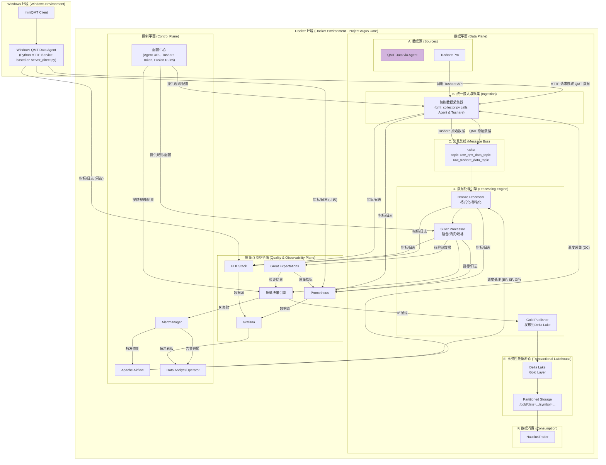

# Project Argus: 天枢计划

## 系统架构设计 (V2.0 - 整合版)

### 1. 核心架构理念

本架构是前两个版本的演进与融合，旨在构建一个**工业级、高韧性、可演进**的数据平台。其核心设计理念升级为：

1.  **事件驱动与彻底解耦 (Event-Driven & Fully Decoupled):** 引入**Apache Kafka**作为系统的中央神经系统。采集与处理被彻底解耦，数据以事件流的形式在系统内传递。这提供了极致的弹性、削峰填谷能力以及未来向实时处理演进的通路。
2.  **声明式控制与动态配置 (Declarative Control & Dynamic Configuration):** 系统的行为（如数据源优先级、融合规则）不再硬编码于代码中，而是由**Airflow (控制平面)**进行声明式调度，并从**外部配置中心**动态加载。这使得系统调整更加敏捷和安全。
3.  **事务性数据湖仓 (Transactional Data Lakehouse):** Gold层存储采用**Delta Lake**格式。这在Parquet的性能之上，增加了**ACID事务、数据版本控制（时间旅行）和Schema强制**等关键能力，从根本上解决了数据一致性与质量问题，防止数据湖沦为“数据沼泽”。
4.  **智能质量门禁 (Intelligent Quality Gates):** 质量保障不再是简单的规则检查，而是升级为**质量决策引擎**。它结合`Great Expectations`的验证结果和动态阈值，能做出更智能的决策（通过、告警、自动修复或转入人工审核）。
5.  **统一接入与安全 (Unified Ingress & Security):** 所有外部数据源的访问都通过一个**API网关**进行，统一负责认证、授权、限流和路由，构成了系统的安全边界。

#### 2. 整合版系统架构图

#### 3. 核心组件详解

*   **A. 数据源 (Sources):**
    *   **Windows QMT Data Agent (独立子项目):**
        *   **当前角色 (HTTP数据代理):** 这是一个独立部署在Windows环境中的Python HTTP服务，其代码库位于 [https://github.com/jiaenyue/project-argus-qmt-agent](https://github.com/jiaenyue/project-argus-qmt-agent)。该服务基于`xtquantai`项目的`server_direct.py`部分，直接与本地运行的miniQMT客户端交互，并通过HTTP接口向Project Argus核心系统的`智能数据采集器`暴露QMT数据。这是当前Project Argus接入miniQMT数据的方式。
        *   **未来潜力 (MCP服务器):** `project-argus-qmt-agent`的原始基础`xtquantai`项目本身是一个完整的MCP (Model Context Protocol)服务器，旨在与AI助手（如Cursor）集成。这意味着`project-argus-qmt-agent`未来也可以扩展以支持MCP模式，允许通过自然语言或特定协议指令调用QMT功能，为Project Argus未来扩展AI驱动的数据分析或交易辅助功能提供了基础。详细的MCP功能和设置请参考`xtquantai`的官方文档。
    *   **QMT Data via Agent:** 在Project Argus架构图中，这代表通过独立部署的`Windows QMT Data Agent`的HTTP接口获取的数据流。
    *   **Tushare Pro:** 职责不变，作为补充和备份数据源，通过其原生API接入。

*   **B. 统一接入与采集 (Ingestion):**
    *   **智能数据采集器 (Data Collector - `qmt_collector.py`):**
        *   由Airflow调度。
        *   **QMT数据采集:** 通过HTTP(S)调用部署在Windows环境上的`Windows QMT Data Agent`来获取miniQMT数据。Agent的URL从`配置中心`获取。
        *   **Tushare数据采集:** 仍然直接通过API调用Tushare Pro。
        *   采集到的原始数据（来自Agent的QMT数据和来自Tushare的数据）作为事件分别或统一发送到`Kafka`的不同主题或带有不同标识的同一主题。
        **[对应需求: FR-001 (via Agent), FR-002, BR-004]**
    *   **API Gateway (可选/未来扩展):** 对于Tushare Pro等云服务的直接调用，未来可以考虑引入API Gateway进行统一管理（认证、限流、路由）。当前对于Windows Agent的内部网络调用，API Gateway的必要性较低。

*   **C. 消息总线 (Message Bus):**
    *   **Apache Kafka:** **[核心整合点]** 系统的“解耦层”和“缓冲池”。原始数据被发布到`raw_data_topic`。这带来了巨大好处：
        1.  **弹性与韧性:** 即使下游处理引擎宕机，数据采集也不会中断，数据被安全地保留在Kafka中。
        2.  **背压处理:** 自动处理上下游速率不匹配的问题。
        3.  **可扩展性:** 未来可以轻松增加新的消费者（如实时异常检测）来消费同一份原始数据，而无需改动采集器。

*   **D. 数据处理引擎 (Processing Engine):**
    *   这是一组由Airflow协调的、消费Kafka消息的批处理任务（可实现为`Spark Structured Streaming`或`KubernetesPodOperator`）。
    *   **Bronze Processor:** 消费`raw_data_topic`，进行格式统一、Schema验证和基础清洗，然后将结果输出到内部的`cleaned_topic`（或直接在内存中传递给下一步）。
    *   **Silver Processor:** 核心处理单元。从`配置中心`获取融合规则，执行时间轴对齐、多源冲突解决、以及使用ML模型（如Prophet）进行智能缺失值填补。**[对应需求: FR-003 to FR-006]**

*   **E. 事务性数据湖仓 (Transactional Lakehouse):**
    *   **Delta Lake:** **[核心整合点]** 最终的Gold层存储格式。它在Parquet之上提供了：
        *   **ACID事务:** 保证数据写入的原子性，杜绝了不完整或脏数据。
        *   **时间旅行:** 可查询任意历史版本的数据，便于审计、回滚和复现问题。
        *   **Schema强制与演进:** 防止脏数据写入，并支持平滑地增加字段。
    *   **分区存储:** 采用更优化的分区策略 `/gold/date=YYYYMMDD/symbol=STOCKCODE`，极大提升按股票查询的性能。**[对应需求: BR-001, FR-011, TR-004]**

*   **F. 数据消费 (Consumption):**
    *   `NautilusTrader`直接高效地读取分区化的Delta Lake/Parquet文件。

#### 4. 平面化管理与监控

*   **控制平面 (Control Plane):**
    *   **Apache Airflow:** 职责不变，但其任务（Task）更倾向于编排容器化作业（如`KubernetesPodOperator`），而非直接执行Python代码，实现更好的资源隔离。
    *   **配置中心 (Configuration Center):** **[整合点]** 如Consul或Nacos。集中存储数据源优先级、融合逻辑、质量规则阈值等，实现配置与代码分离，支持动态热更新。
    *   **Alertmanager:** 负责告警的路由、去重和抑制，根据策略将告警分发给不同的人或系统。

*   **质量与监控平面 (Quality & Observability Plane):**
    *   **Great Expectations (GE):** 作为规则库，被`质量决策引擎`调用。
    *   **质量决策引擎 (Quality Decision Engine):** **[整合点]** 这是GE的智能“上层”。它执行GE的规则集，并结合从`配置中心`获取的动态阈值（例如，市场波动大时放宽某些检查），最终决定数据是`通过`进入Gold层，还是`失败`触发告警和修复流程。**[对应需求: FR-007, BR-003]**
    *   **Prometheus, Grafana, ELK:** 职责不变，构成全面的可观测性技术栈，监控从API网关到数据消费的全链路指标、日志和数据质量。**[对应需求: NFR-001 to NFR-008]**

#### 5. 关键技术决策与优势

1.  **Kafka vs. Direct Processing:** 选择Kafka引入了轻微的延迟和运维成本，但换来了无与伦比的系统弹性和可扩展性，这是工业级系统的标志。
2.  **Delta Lake vs. Raw Parquet:** 选择Delta Lake增加了对Spark/Delta库的依赖，但彻底解决了批处理ETL中常见的数据一致性和可靠性难题，极大提升了Gold层数据的“黄金”成色。
3.  **Config Center vs. Hardcoding:** 采用配置中心使得系统更加灵活，运维人员或数据分析师可以在不重新部署代码的情况下调整数据处理逻辑，大大缩短了响应时间。
4.  **Windows Data Agent for miniQMT:** 通过在Windows端部署一个轻量级HTTP代理服务（基于`xtquantai/server_direct.py`），成功将miniQMT的Windows平台依赖与Project Argus核心系统的Docker化环境解耦。这使得核心数据管道可以保持其跨平台和容器化的优势，同时能够安全、稳定地接入miniQMT数据。采集器通过配置的URL与代理通信，降低了直接库依赖带来的复杂性和潜在冲突。值得注意的是，`xtquantai`项目本身支持MCP (Model Context Protocol)，这意味着该Windows Data Agent的原始项目具备与AI助手集成的能力，为未来系统的智能化扩展（如通过自然语言查询QMT数据或执行简单操作）预留了可能性。
