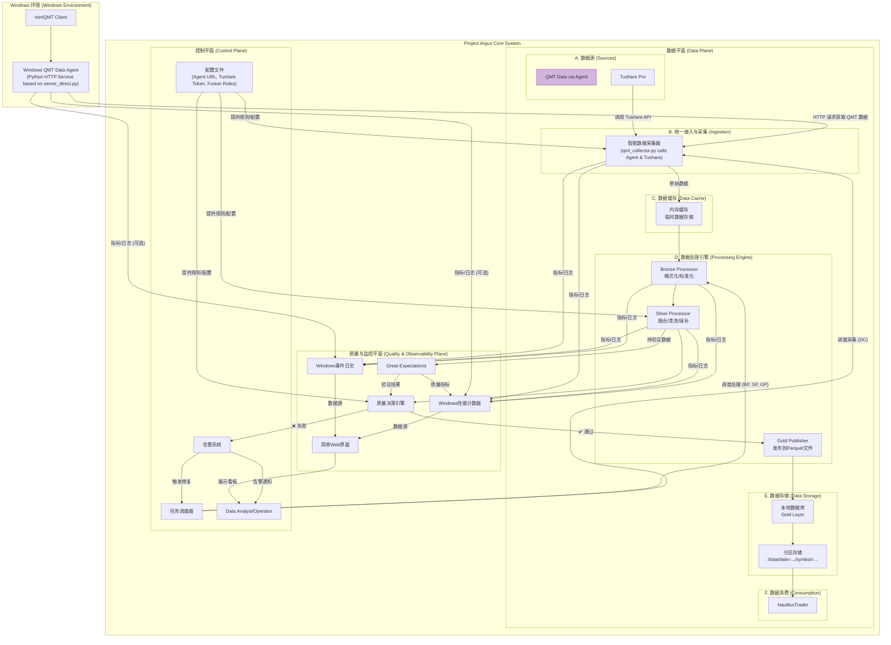

# Project Argus: 天枢计划

## 系统架构设计 (V2.0 - 整合版)

### 1. 核心架构理念

本架构是前两个版本的演进与融合，旨在构建一个**工业级、高韧性、可演进**的数据平台。其核心设计理念升级为：

1.  **事件驱动与彻底解耦 (Event-Driven & Fully Decoupled):** 采集与处理被彻底解耦，数据以事件流的形式在系统内传递。这提供了极致的弹性、削峰填谷能力以及未来向实时处理演进的通路。
2.  **声明式控制与动态配置 (Declarative Control & Dynamic Configuration):** 系统的行为（如数据源优先级、融合规则）不再硬编码于代码中，而是通过配置文件进行动态加载。这使得系统调整更加敏捷和安全。
3.  **高效数据存储 (Efficient Data Storage):** Gold层存储采用优化的数据格式，提供高性能的数据访问和查询能力。
4.  **智能质量门禁 (Intelligent Quality Gates):** 质量保障不再是简单的规则检查，而是升级为**质量决策引擎**。它结合验证结果和动态阈值，能做出更智能的决策（通过、告警、自动修复或转入人工审核）。
5.  **统一接入与安全 (Unified Ingress & Security):** 所有外部数据源的访问都通过统一的接口进行，负责认证、授权、限流和路由，构成了系统的安全边界。

#### 2. 整合版系统架构图

#### 3. 核心组件详解

*   **A. 数据源 (Sources):**
    *   **Windows QMT Data Agent (独立子项目):**
        *   **当前角色 (HTTP数据代理):** 这是一个独立部署在Windows环境中的Python HTTP服务，其代码库位于 [https://github.com/jiaenyue/project-argus-qmt-agent](https://github.com/jiaenyue/project-argus-qmt-agent)。该服务基于`xtquantai`项目的`server_direct.py`部分，直接与本地运行的miniQMT客户端交互，并通过HTTP接口向Project Argus核心系统的`智能数据采集器`暴露QMT数据。这是当前Project Argus接入miniQMT数据的方式。
        *   **未来潜力 (MCP服务器):** `project-argus-qmt-agent`的原始基础`xtquantai`项目本身是一个完整的MCP (Model Context Protocol)服务器，旨在与AI助手（如Cursor）集成。这意味着`project-argus-qmt-agent`未来也可以扩展以支持MCP模式，允许通过自然语言或特定协议指令调用QMT功能，为Project Argus未来扩展AI驱动的数据分析或交易辅助功能提供了基础。详细的MCP功能和设置请参考`xtquantai`的官方文档。
    *   **QMT Data via Agent:** 在Project Argus架构图中，这代表通过独立部署的`Windows QMT Data Agent`的HTTP接口获取的数据流。
    *   **Tushare Pro:** 职责不变，作为补充和备份数据源，通过其原生API接入。

*   **B. 统一接入与采集 (Ingestion):**
    *   **智能数据采集器 (Data Collector - `qmt_collector.py`):**
        *   由Windows任务调度器调度。
        *   **QMT数据采集:** 通过HTTP(S)调用部署在Windows环境上的`Windows QMT Data Agent`来获取miniQMT数据。Agent的URL从`配置中心`获取。
        *   **Tushare数据采集:** 仍然直接通过API调用Tushare Pro。
        *   采集到的原始数据（来自Agent的QMT数据和来自Tushare的数据）作为事件分别或统一发送到本地文件队列进行处理。
        **[对应需求: FR-001 (via Agent), FR-002, BR-004]**
    *   **API Gateway (可选/未来扩展):** 对于Tushare Pro等云服务的直接调用，未来可以考虑引入API Gateway进行统一管理（认证、限流、路由）。当前对于Windows Agent的内部网络调用，API Gateway的必要性较低。

*   **C. 数据缓存 (Data Cache):**
    *   **内存缓存:** 系统的"缓冲层"。原始数据被临时存储在内存中进行快速处理。这带来了以下好处：
        1.  **高性能:** 内存访问速度快，减少I/O开销。
        2.  **简化架构:** 避免了复杂的消息队列配置和维护。
        3.  **资源效率:** 在Windows环境下更加轻量级和高效。

*   **D. 数据处理引擎 (Processing Engine):**
    *   这是一组由任务调度器协调的批处理任务，直接在Windows环境下运行。
    *   **Bronze Processor:** 处理原始数据，进行格式统一、Schema验证和基础清洗，然后将结果传递给下一步处理。
    *   **Silver Processor:** 核心处理单元。从配置文件获取融合规则，执行时间轴对齐、多源冲突解决、以及使用ML模型进行智能缺失值填补。**[对应需求: FR-003 to FR-006]**

*   **E. 数据存储 (Data Storage):**
    *   **本地数据库:** 最终的Gold层存储。提供以下特性：
        *   **数据完整性:** 保证数据写入的完整性和一致性。
        *   **高效查询:** 支持快速的数据查询和检索。
        *   **数据备份:** 支持数据备份和恢复机制。
    *   **分区存储:** 采用优化的分区策略 `/data/date=YYYYMMDD/symbol=STOCKCODE`，极大提升按股票查询的性能。**[对应需求: BR-001, FR-011, TR-004]**

*   **F. 数据消费 (Consumption):**
    *   `NautilusTrader`直接高效地读取分区化的本地数据库文件。

#### 4. 平面化管理与监控

*   **控制平面 (Control Plane):**
    *   **任务调度器:** 负责协调和调度各种数据处理任务，直接执行Python代码，实现高效的任务管理。
    *   **配置文件 (Configuration Files):** 集中存储数据源优先级、融合逻辑、质量规则阈值等，实现配置与代码分离，支持动态配置更新。
    *   **告警系统:** 负责告警的处理和通知，根据策略将告警分发给相关人员或系统。

*   **质量与监控平面 (Quality & Observability Plane):**
    *   **数据质量检查:** 作为规则库，被`质量决策引擎`调用。
    *   **质量决策引擎 (Quality Decision Engine):** 执行质量检查规则集，并结合从配置文件获取的动态阈值，最终决定数据是`通过`进入Gold层，还是`失败`触发告警和修复流程。**[对应需求: FR-007, BR-003]**
    *   **监控系统:** 构成全面的可观测性技术栈，监控从数据采集到数据消费的全链路指标、日志和数据质量。**[对应需求: NFR-001 to NFR-008]**

#### 5. 关键技术决策与优势

1.  **内存缓存 vs. 消息队列:** 选择内存缓存简化了系统架构，减少了运维复杂度，在Windows环境下提供了更好的性能和稳定性。
2.  **本地数据库 vs. 分布式存储:** 选择本地数据库降低了系统复杂度，在单机环境下提供了更好的性能和可靠性，同时简化了部署和维护。
3.  **配置文件 vs. 硬编码:** 采用配置文件使得系统更加灵活，运维人员或数据分析师可以在不重新部署代码的情况下调整数据处理逻辑，大大缩短了响应时间。
4.  **Windows Data Agent for miniQMT:** 通过在Windows端部署一个轻量级HTTP代理服务（基于`xtquantai/server_direct.py`），成功将miniQMT的Windows平台依赖与Project Argus核心系统解耦。这使得核心数据管道能够安全、稳定地接入miniQMT数据。采集器通过配置的URL与代理通信，降低了直接库依赖带来的复杂性和潜在冲突。值得注意的是，`xtquantai`项目本身支持MCP (Model Context Protocol)，这意味着该Windows Data Agent的原始项目具备与AI助手集成的能力，为未来系统的智能化扩展（如通过自然语言查询QMT数据或执行简单操作）预留了可能性。
