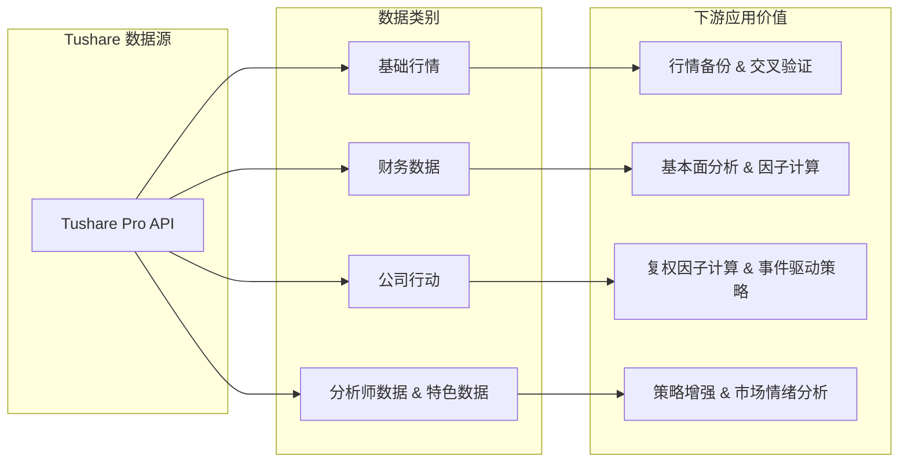
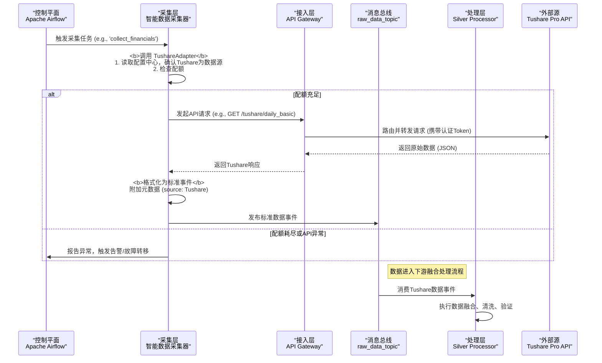
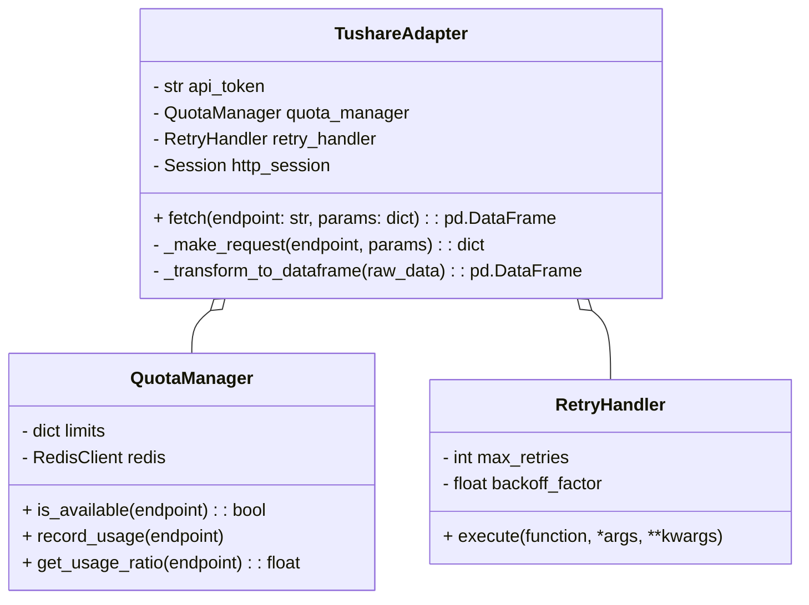
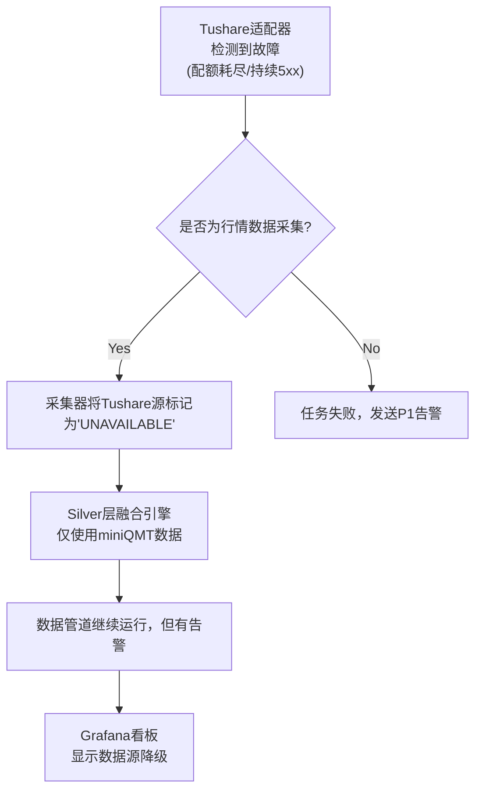
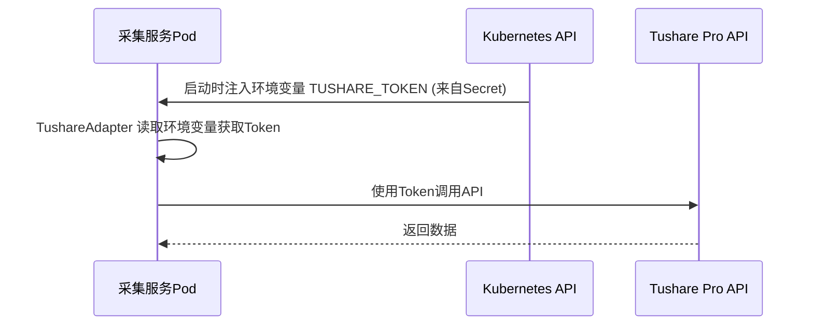
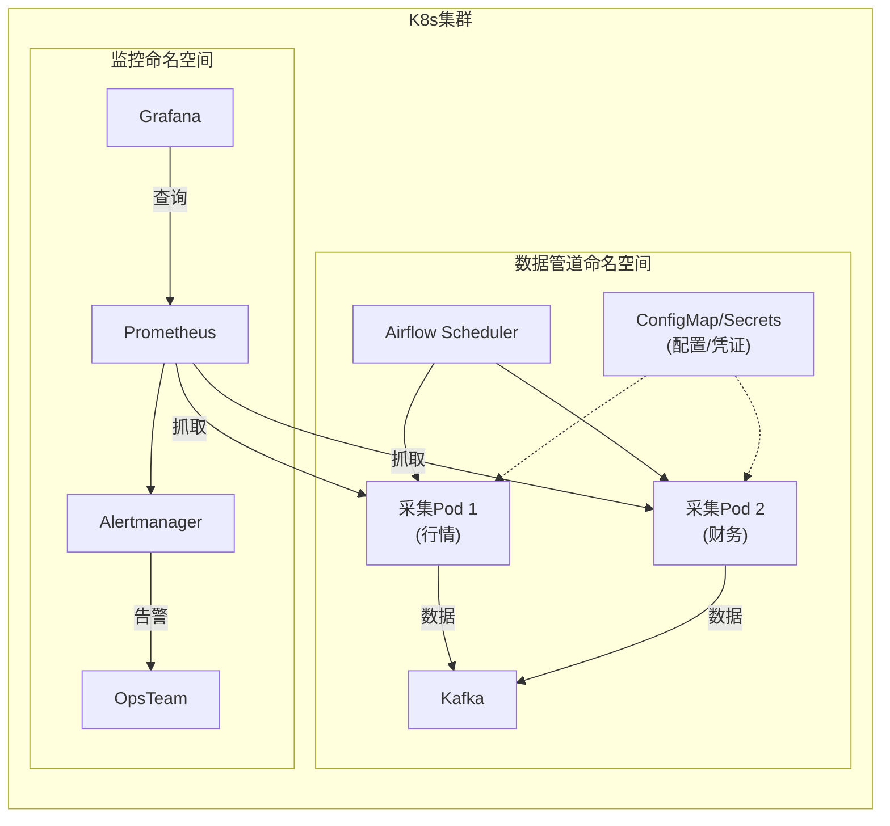

##  Tushare Pro 集成设计文档

**项目名称:** Project Argus: 天枢计划
**文档版本:** 2.0 (整合最终版)
**编制人:** 资深研发工程师 & 项目团队
**日期:** 2023-10-30
**关联文档:** `plan.md`, `SystemDesign.md`, `Data_Governance_and_Dictionary.md`, `QualityKPI.md`, `RequirementsTraceabilityMatrix.md`

---

### 1. 目标与范围

#### 1.1 集成目标
*   **安全高效地**集成 Tushare Pro API 作为核心补充与备份数据源。
*   为系统提供 miniQMT 所不具备的**财务数据、公司行动、分析师评级**等关键数据维度。 (**关联需求: BR-002**)
*   作为 miniQMT 行情数据的**备用源**，实现无缝、自动化的故障转移，增强系统韧性。 (**关联需求: BR-004**)
*   严格遵循 `Data_Governance_and_Dictionary.md` 中定义的多源融合与优先级原则。

#### 1.2 集成范围
Tushare Pro 将为数据管道提供以下类别的数据，以支撑相应的数据应用：


### 2. 架构设计

#### 2.1 整体接入架构
Tushare的集成将无缝融入 **`SystemDesign.md (V2.0)`** 定义的事件驱动架构中，确保系统的解耦与弹性。



#### 2.2 关键组件说明
| 组件 | 职责 | 技术实现 / 关联模块 |
| :--- | :--- | :--- |
| **API网关** | 统一入口、认证、路由、限流、熔断。 | Kong / Nginx / 自研网关 |
| **Tushare适配器** | **核心模块**。封装API调用、重试、配额管理、数据转换。 | 详见3.1节，Python类 |
| **智能配额管理器** | 监控配额，动态决策，支持分布式。 | 详见3.2节，Python类 + Redis |
| **配置中心** | 存储API Token、优先级、配额限制、重试策略。 | Consul / Nacos |
| **多源一致性检查** | 在Silver层比对QMT与Tushare重叠数据。 | 详见4.2节，自定义校验器 |
| **监控与告警** | 实时采集API指标、配额使用率并告警。 | Prometheus + Grafana + Alertmanager |

### 3. 详细设计

#### 3.1 Tushare适配器 (`TushareAdapter`) 核心设计
`TushareAdapter` 是一个可复用的Python模块，封装了所有与Tushare API交互的复杂性。

*   **设计原则**：单一职责、配置驱动、韧性设计、可观测性。
*   **实现要点**：
    1.  所有外部请求通过 `RetryHandler` 执行，实现指数退避重试。
    2.  每次请求前调用 `QuotaManager.is_available()` 检查配额。
    3.  使用 `requests.Session` 和 `HTTPAdapter` 管理连接池，提升性能。
    4.  将Tushare返回的JSON转换为Pandas DataFrame，并进行初步的字段名标准化。

#### 3.2 智能配额管理 (`TushareQuotaManager`)
这是保障系统稳定运行的关键，防止因配额耗尽导致任务失败。
```python
# 伪代码 - QuotaManager
class TushareQuotaManager:
    def __init__(self, limits: dict, redis_conn):
        self.limits = limits
        self.redis = redis_conn # 使用Redis持久化当日用量，支持分布式
        self.KEY_PREFIX = "tushare:quota:usage:"

    def is_available(self, endpoint: str) -> bool:
        usage = int(self.redis.get(f"{self.KEY_PREFIX}{endpoint}") or 0)
        limit = self.limits.get(endpoint, float('inf'))
        
        if usage >= limit:
            return False
            
        # 预警机制
        if usage / limit >= 0.9:
            # 触发P1级告警
            alert(f"Tushare quota for {endpoint} is at {usage / limit * 100:.1f}%", level="P1")
        return True

    def record_usage(self, endpoint: str):
        key = f"{self.KEY_PREFIX}{endpoint}"
        self.redis.incr(key)
        self.redis.expire(key, 24 * 3600) # 设置24小时过期
```

#### 3.3 数据源优先级与配额配置 (存于配置中心)
```yaml
# config/data_sources.yaml
source_priority:
  price: { miniQMT: 1, Tushare: 2 }
  volume: { miniQMT: 1, Tushare: 2 }
  financials: { Tushare: 1, miniQMT: 3 }
  corporate_actions: { Tushare: 1 }

# config/tushare.yaml
api_token: "env_var:TUSHARE_TOKEN"
quota_limits:
  daily: 20000
  adj_factor: 20000
  daily_basic: 10000
  dividend: 5000
```

#### 3.4 数据映射与治理
数据映射在 **Silver层** 进行，以确保数据源的原始性。
| Gold Layer 字段 | 来源优先级 | Tushare API | Tushare 字段 | 转换/处理逻辑 (在Silver层) |
| :--- | :--- | :--- | :--- | :--- |
| `close` | `miniQMT > Tushare` | `daily` | `close` | 1. 仅当miniQMT数据无效时使用。<br>2. 必须与`adj_factor`结合进行后复权计算。 |
| `adj_factor`| `Tushare > miniQMT`| `adj_factor`| `adj_factor`| 作为计算所有后复权价格的基准。 |
| `pe_ttm` | `Tushare > miniQMT`| `daily_basic`| `pe_ttm` | 直接映射。如果Tushare无此数据，则填充 `NULL`。 |
| `div_cash` | `Tushare 唯一`| `dividend` | `cash_div_tax_before`| 合并到对应交易日。需要进行时间对齐。 |
| `close_source`| `内部生成` | - | - | 若`close`字段最终采用Tushare数据，则此字段记为 'Tushare'。 |

### 4. 数据质量保障

#### 4.1 采集层质量验证规则 (Great Expectations)
在数据被写入Kafka前，进行初步校验。
```json
{
  "expectation_suite_name": "tushare_raw_validation",
  "expectations": [
    {"expectation_type": "expect_column_values_to_not_be_null", "kwargs": {"column": "close", "mostly": 0.99}},
    {"expectation_type": "expect_column_pair_values_A_to_be_greater_than_B", "kwargs": {"column_A": "high", "column_B": "low"}},
    {"expectation_type": "expect_column_values_to_be_of_type", "kwargs": {"column": "trade_date", "type_": "string"}},
    {"expectation_type": "expect_column_values_to_match_regex", "kwargs": {"column": "ts_code", "regex": "^\\d{6}\\.(SH|SZ|BJ)$"}}
  ]
}
```

#### 4.2 Silver层多源一致性检查
这是确保数据准确性的核心环节。
```python
def check_multi_source_consistency(qmt_data: pd.DataFrame, ts_data: pd.DataFrame) -> dict:
    """在Silver层比较QMT和Tushare的重叠数据"""
    merged = pd.merge(qmt_data, ts_data, on=['symbol', 'trade_date'], suffixes=('_qmt', '_ts'))
    
    # 计算收盘价相对差异
    merged['close_diff_pct'] = (merged['close_qmt'] - merged['close_ts']).abs() / merged['close_qmt']
    
    # 核心一致性指标 (关联DQ-CON-01)
    consistency_ratio = (merged['close_diff_pct'] <= 0.005).mean()
    
    # 识别并上报显著差异，供人工审核
    significant_diffs = merged[merged['close_diff_pct'] > 0.01]
    
    return {
        "consistency_ratio": consistency_ratio,
        "significant_diff_count": len(significant_diffs)
    }
```

### 5. 错误处理与容灾

#### 5.1 错误分类与处理策略
| 错误类型 | 处理策略 | 重试机制 | 告警级别 |
| :--- | :--- | :--- | :--- |
| **网络错误/超时** | 指数退避重试 | 3次，间隔1s, 2s, 4s | P2 (日志) |
| **API配额不足** | **自动故障转移** (对行情数据)，或**终止任务** (对补充数据) | 无 | P1 |
| **数据格式错误** | 丢弃脏记录，记录日志 | 无 | P2 (日志) |
| **认证失败 (401)** | **立即终止任务** | 无 | **P0** |
| **服务不可用 (5xx)** | 指数退避重试，若持续失败则**自动故障转移** | 2次重试后切换 | **P0** |

#### 5.2 故障转移流程 (针对行情数据)


### 6. 安全设计

#### 6.1 安全控制措施
| 安全领域 | 控制措施 | 实施方式 |
| :--- | :--- | :--- |
| **认证** | **动态短期凭证**，Token轮换 | Vault / K8s Secrets + API网关 |
| **授权** | IP白名单，最小权限原则 | API网关配置，Tushare后台设置 |
| **传输安全** | 端到端TLS 1.3加密 | 全链路HTTPS通信 |
| **凭证存储** | **严禁硬编码**，使用安全存储 | K8s Secrets注入环境变量 |
| **审计** | 完整、不可变的访问日志 | ELK/Loki集中存储与分析 |

#### 6.2 凭证管理流程


### 7. 性能优化

#### 7.1 性能优化策略
1.  **批量请求优化**: 对支持批量查询的接口（如`daily_basic`），将单日所有股票代码拼接成一个请求，减少网络往返。
2.  **缓存策略**: 对不经常变化的元数据（如股票列表`stock_basic`），使用Redis进行日级缓存。
3.  **连接池管理**: `TushareAdapter`中使用`requests.Session`和`HTTPAdapter`复用TCP连接。
4.  **并发采集**: Airflow DAG中可使用`KubernetesPodOperator`启动多个并行的采集Pod，分别采集不同类型的数据（如财务、行情），提高总体吞吐量。

#### 7.2 性能指标目标
| 指标 | 目标值 | 监控频率 |
| :--- | :--- | :--- |
| API P95响应时间 | < 2s | 实时 |
| 数据采集吞吐量 | > 5000条记录/分钟/Pod | 每日 |
| API错误率 | < 0.1% | 每小时 |
| 配额日使用率 | < 90% (正常情况) | 实时 |

### 8. 部署与运维

#### 8.1 部署架构 (K8s)


#### 8.2 监控仪表盘 (Grafana) - Tushare专项
*   **API健康度**: 各接口请求成功率、错误率（分状态码）、P95延迟。
*   **配额状态**: 各接口配额实时使用率（进度条）、预计耗尽时间。
*   **数据量**: 各接口采集的数据记录数。
*   **一致性**: 与miniQMT的收盘价一致性比率（时序图）。

### 9. 实施路线图
| 阶段 | 时间 | 里程碑 | 关键交付物 |
| :--- | :--- | :--- | :--- |
| **1. 基础接入** | 第1周 | `TushareAdapter`与配额管理模块完成。 | 可独立运行的采集脚本、单元测试。 |
| **2. 行情备份** | 第2周 | 行情数据采集与故障转移逻辑集成。 | 更新后的Airflow DAG、多源一致性检查模块。 |
| **3. 数据补充** | 第3周 | 财务、公司行动数据接入与融合。 | 扩展后的Gold层Schema、更新的Silver层处理器。 |
| **4. 监控与优化**| 第4周 | Grafana看板与告警规则部署。 | 监控仪表盘URL、告警SOP。 |
| **5. 上线与稳定**| 第5周 | 全功能上线，进入观察期。 | 最终版部署脚本、运维手册。 |

### 10. 风险管理
| 风险 | 概率 | 影响 | 缓解措施 |
| :--- | :--- | :--- | :--- |
| **Tushare API不兼容变更** | 高 | 高 | **抽象适配器层**隔离变更；**CI/CD中的契约测试**提前发现。 |
| **配额意外耗尽** | 中 | 高 | **P1级提前告警 (90%)**；**自动故障转移**确保核心业务连续性。 |
| **多源数据显著差异** | 高 | 中 | **自动化一致性监控**；差异数据进入**人工审核队列**；以`miniQMT`为准绳。 |
| **性能瓶颈** | 中 | 中 | **水平扩展**（增加采集Pod）；**缓存策略**；**批量查询**。 |
| **安全凭证泄露** | 低 | 高 | **遵循最小权限**；**动态短期凭证**；**定期安全审计**与漏洞扫描。 |