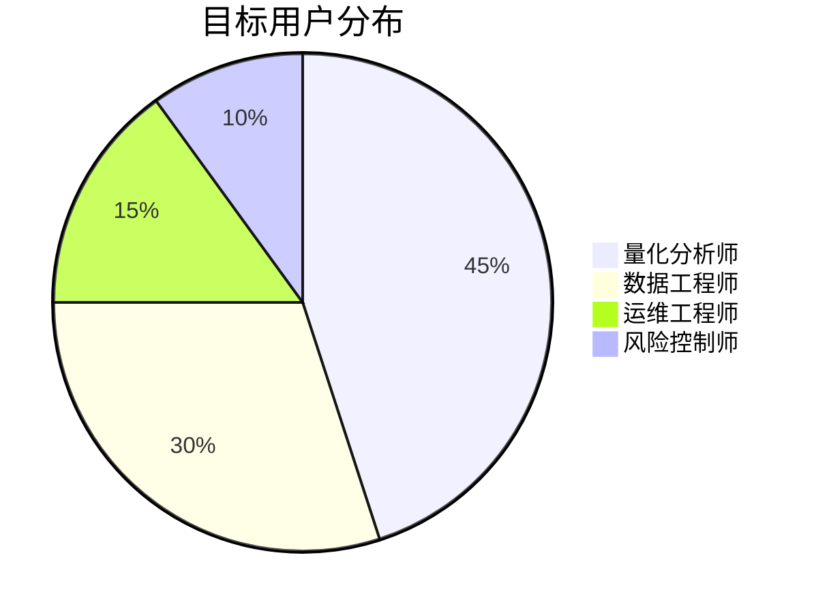

# Project Argus 愿景文档

## 核心价值主张

- **量化交易数据基石**：提供稳定、高效、准确的金融数据服务，作为量化交易系统的基础设施。
- **多源融合的黄金标准**：整合来自多个数据源（如Tushare、QMT等）的数据，通过智能融合算法生成一致、可靠的数据集。
- **生产级数据SLA保障**：确保数据服务的高可用性和及时性，满足生产环境的需求。

## 用户画像矩阵

## 成功指标体系

- **数据新鲜度**：从数据产生到可用的时间不超过15分钟（L1级指标）
- **融合一致性**：多源数据融合后的一致性达到99.95%以上（L2级指标）
- **故障恢复**：系统故障后恢复时间不超过120秒（L3级指标）