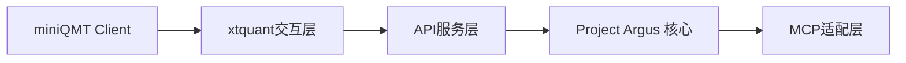

# Project Argus QMT Data Agent: 系统架构设计

本文档详细描述了 Project Argus QMT 数据代理 (以下简称“数据代理”或“本服务”) 的系统架构。数据代理的核心目的是作为在 Windows 环境下运行的 miniQMT (迅投量化交易客户端) 与 Project Argus (或其他需要访问 miniQMT 数据的系统) 之间的数据桥梁，解决跨平台数据访问的挑战。

## 1. 架构概述
数据代理采用分层架构，确保模块化、可维护性和未来扩展性。其在 Project Argus 生态系统中的定位是提供稳定、可靠的实时和历史行情数据源。
Project Argus 数据代理采用三层架构实现 QMT 数据接入：


**数据流**：
- 主要数据流: miniQMT 原始数据 → `xtquant` 库封装 → 数据代理API服务层 (Python FastAPI) → HTTP(S) API 传输 → Project Argus 数据管道或其他消费端。
- Project Argus 层面可能集成 Tushare Pro 等作为备用或补充数据源，但本数据代理专注于提供 QMT 数据。

## 2. 核心组件职责

### 2.1 `xtquant`交互层
- **职责**: 与本地 Windows 环境中运行的 miniQMT 客户端进程通过 `xtquant` Python库进行实时通信。
- **功能**:
    - 初始化与 miniQMT 的连接。
    - 调用 `xtquant` 的函数获取行情数据 (如K线、代码列表、合约信息等)。
    - 将从 `xtquant` 获取的原始数据（通常是 Pandas DataFrame 或特定对象）转换为标准化的JSON格式，供API服务层使用。
    - **异常处理**: 关键部分，包括：
        - **连接管理**: 检测与 QMT 的连接状态，尝试重连机制 (例如，在启动时或检测到连接断开后)。
        - **数据请求错误**: 处理 `xtquant` 可能返回的错误码或异常 (如代码不存在、无数据返回、请求过于频繁等)。
        - **数据解析错误**: 确保数据转换过程的健壮性。
    - **连接保活**: 部分 `xtquant` 功能可能需要定期心跳或活动来维持会话，本层需处理此类机制（如果 `xtquant` 库本身不自动管理）。

### 2.2 API服务层
- **技术栈**: 基于 FastAPI 框架实现。
- **功能**:
    - **RESTful HTTP(S) 接口**: 暴露定义清晰的 HTTP(S) API 端点 (Endpoints)，用于各类数据查询。具体接口见“接口规范”部分。
    - **请求处理与校验**:接收 HTTP 请求，校验输入参数的有效性（如日期格式、股票代码格式等）。
    - **调用交互层**: 将校验后的请求传递给 `xtquant`交互层以获取数据。
    - **响应构建**: 将从交互层获取的JSON数据封装成标准的HTTP响应（包括正确的状态码和头部）。
    - **请求鉴权**:
        - **API Key 验证**: 通过 HTTP头部 (如 `X-API-Key`) 传递API密钥进行服务间认证，确保只有授权客户端可以访问。这是基础安全措施。
        - (未来可选) 可考虑集成更复杂的认证机制如 OAuth2，若需支持用户级别授权或更细粒度的权限控制。
    - **数据缓存 (初步策略)**:
        - **交易日历等静态数据**: 首次获取后可进行内存缓存，设置合理的过期时间 (如每日更新)。
        - **频繁请求的K线/快照**: 可考虑引入轻量级缓存 (如 `cachetools` 本地内存缓存)，降低对 QMT 的请求压力，提高响应速度。缓存周期需根据数据更新频率设定。
    - **流控与限速**: 防止恶意或错误的客户端请求导致过载。FastAPI 可集成相关中间件实现基于IP或API Key的请求频率限制。

**集成 Argus 方式示例 (与 `doc/user_story.md` 中的API路径对齐)**：
```python
# Argus 采集器调用示例 - 获取历史K线
response = requests.get(
    "http://{agent_ip}:8000/hist_kline",
    params={"symbol": "600519.SH", "start_date": "20230101", "end_date": "20231231", "frequency": "1d"},
    headers={"X-API-Key": "argus-system-key"}
)
# Argus 采集器调用示例 - 获取交易日历
response = requests.get(
    "http://{agent_ip}:8000/trading_dates",
    params={"market": "SH", "start_date": "20250101", "end_date": "20251231"},
    headers={"X-API-Key": "argus-system-key"}
)
```

### 2.3 MCP适配层 (未来规划)
- **目标**: 遵循 `doc/vision.md` 中的规划，利用 `xtquantai` 项目的 Model Context Protocol (MCP) 特性，使数据代理能够被AI助手或其他MCP兼容工具直接调用。
- **功能**:
    - **MCP协议实现**: 启动一个符合MCP规范的服务端点。
    - **指令解析**: 将来自AI助手的自然语言或结构化指令（如 `get_stock_price("600519.SH")`）映射到对 `xtquant`交互层的具体调用。
    - **上下文管理**: 可能需要维护与AI助手交互的上下文信息。
    - **动态服务注册/发现**: 若在更复杂的AI框架中，可能需要支持服务的注册与发现。
- **价值**: 极大地提升数据获取的灵活性和智能化水平，降低数据分析的门槛。

## 3. 接口规范
本服务提供符合 OpenAPI (Swagger) 规范的 RESTful API。以下为主要数据获取接口（具体参数和响应结构请参考代码中的 FastAPI 自动生成的 `/docs` 路径下的 OpenAPI 文档）。

| 端点路径                 | 方法 | 主要参数                                     | 简要描述                       | 对应 `xtquant` 功能 (参考)         |
|--------------------------|------|----------------------------------------------|--------------------------------|------------------------------------|
| `/api/get_trading_dates` | GET  | `market` (e.g., "SH", "SZ"), `start_date` (YYYYMMDD, optional), `end_date` (YYYYMMDD, optional) | 获取指定市场和日期范围的交易日历 | `xtdata.get_trading_dates`         |
| `/stock_list`            | GET  | `sector` (如 "沪深A股", "上证A股")           | 获取板块内的股票列表           | `xtdata.get_stock_list_in_sector`  |
| `/instrument_detail`     | GET  | `symbol` (如 "600519.SH")                    | 获取单个合约的详细信息         | `xtdata.get_instrument_detail`     |
| `/hist_kline`            | GET  | `symbol`, `start_date`, `end_date`, `frequency` (e.g., "1m", "1d") | 获取历史K线数据 (OHLCV)        | `xtdata.get_history_market_data`   |
| `/latest_market`         | GET  | `symbols` (逗号分隔, e.g., "600519.SH,000001.SZ") | 获取多个合约的最新行情快照     | `xtdata.get_latest_market_data`    |
| `/full_market`           | GET  | `symbol`, `fields` (可选)                    | 获取单个合约的完整行情数据     | `xtdata.get_full_market_data`      |
| `/create_chart_panel`    | POST | (依赖QMT客户端UI交互, 具体参数待定)          | (可选) 创建图表面板            | `xtdata.create_chart_panel`        |

**通用请求头部**:
- `X-API-Key`: (必需) 用于认证的API密钥。

**通用响应结构 (示例 - 历史K线)**:
```json
// GET /hist_kline?symbol=000001.SZ&start_date=20230101&end_date=20230105&frequency=1d
{
  "symbol": "000001.SZ",
  "frequency": "1d",
  "data": [
    {"time": "2023-01-03 00:00:00", "open": 13.1, "high": 13.2, "low": 13.0, "close": 13.15, "volume": 12345600, ...},
    {"time": "2023-01-04 00:00:00", "open": 13.16, "high": 13.3, "low": 13.1, "close": 13.22, "volume": 9876500, ...},
    {"time": "2023-01-05 00:00:00", "open": 13.22, "high": 13.28, "low": 13.15, "close": 13.20, "volume": 1000500, ...}
  ]
}
```
*注意: 实际字段名和时间戳格式以API实现为准。*

## 4. 部署要求

### 拓扑架构
```mermaid
graph TD
    subgraph "Windows Server/PC"
        QMT[miniQMT Client]
        AGENT[QMT Data Agent (Python FastAPI on port 8000)]
    end
    subgraph "Project Argus Core System"
        ARGUS[Project Argus Core]
        CACHE[(Data Cache)]
        SCHEDULER[(Task Scheduler)]
        OTHER_CONSUMERS[Other API Consumers]
    end
    QMT --> AGENT
    AGENT -- HTTP(S) --> ARGUS
    AGENT -- HTTP(S) --> OTHER_CONSUMERS
    ARGUS --> CACHE
    ARGUS --> SCHEDULER
```

### 配置要求
1.  **运行环境 (Windows Server/PC)**:
    *   **操作系统**: Windows 10 Pro, Windows Server 2016 或更高版本 (64位)。
    *   **miniQMT客户端**: 已安装并成功登录的迅投miniQMT个人版或机构版客户端。建议使用最新稳定版本，并关注 `xtquant` 库对QMT版本的兼容性。
    *   **Python环境**:
        *   Python 3.11+ (64位), as specified in `README.md`.
        *   建议使用虚拟环境 (如 `venv` 或 `conda`) 管理项目依赖。
        *   `xtquant` 库 (版本需与 `README.md` 中指定或项目 `requirements.txt` 一致, e.g., 0.1.2+).
        *   FastAPI 运行时及其依赖 (e.g., `fastapi`, `uvicorn`).
2.  **网络**:
    *   数据代理服务绑定的端口 (默认为 `8000`，可通过环境变量 `QMT_DATA_AGENT_PORT` 配置) 必须在 Windows 防火墙中开放。
    *   Project Argus 核心系统或其他API消费者必须能够通过网络访问到运行数据代理的 Windows 主机的 IP 地址和指定端口。
3.  **安全**:
    *   **HTTPS**: 在生产环境中，强烈建议为API服务配置HTTPS加密传输。这通常涉及获取SSL证书并在 `uvicorn` 或Windows IIS反向代理中配置。
    -   **API Key**: `X-API-Key` 必须妥善管理和轮换。密钥应具有足够的复杂度。
    *   **主机安全**: 运行数据代理的 Windows 主机应遵循标准安全实践 (如最小权限原则、及时更新补丁等)。

## 5. 日志记录和监控

### 5.1 日志记录
- **日志类型**:
    - **访问日志**: 记录所有API请求的概要信息 (请求路径、方法、客户端IP、响应状态码、处理时间)。`uvicorn` 提供访问日志功能。
    - **应用日志**: 记录服务启动/关闭、`xtquant` 交互 (如连接QMT成功/失败、数据获取开始/结束)、错误和异常 (包括完整的堆栈跟踪)、重要业务逻辑执行情况。
    - **`xtquant` 日志**: `xtquant` 库本身可能产生日志，需配置收集。
- **日志格式**: 建议采用结构化日志 (如JSON格式)，方便后续的收集、查询和分析 (例如通过日志管理系统)。
- **日志级别**: 支持标准日志级别 (DEBUG, INFO, WARNING, ERROR, CRITICAL)。生产环境通常配置为 INFO 或 WARNING 级别。
- **日志输出**: 可配置输出到控制台 (开发环境) 和/或文件 (生产环境)。日志文件应支持按大小或时间进行轮转。

### 5.2 监控
- **关键指标**:
    - **系统资源**: 主机CPU、内存、磁盘I/O、网络I/O使用率。
    - **服务健康**: API服务的可用性 (心跳检测端点，如 `/health`)、错误率 (HTTP 5xx 错误比例)。
    - **API性能**: 平均响应时间、p95/p99响应时间、请求吞吐量 (QPS)。
    - **`xtquant`交互**: 与QMT的连接状态、`xtquant`调用成功率/失败率、数据获取延迟。
- **监控工具**:
    - **监控系统**: 可通过 FastAPI 中间件暴露metrics端点，供监控系统采集。
    - **监控仪表盘**: 用于可视化采集的指标，创建仪表盘。
    - **Windows性能监视器**: 用于监控主机级别的系统资源。
- **告警**:
    - 当关键指标超出预设阈值时 (如错误率过高、响应时间过长、QMT连接断开)，应能通过邮件、短信或其他即时通讯工具发送告警。