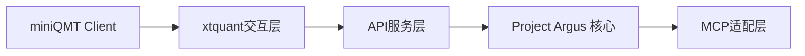

  
# 数据代理系统架构设计  

## 1. 架构概述  
Project Argus 数据代理采用三层架构实现 QMT 数据接入：  


**数据流**：  
- miniQMT 原始数据 → xtquant 封装 → HTTP API 传输 → Argus 数据管道  
- 支持 Tushare Pro 备用数据源无缝切换  

## 2. 核心组件职责  

### 2.1 xtquant交互层  
- 直接与 miniQMT 客户端进程通信  
- 封装 XTAPI 原始数据为结构化 JSON  
- 异常处理与连接保活机制  

### 2.2 API服务层  
**功能**：  
- 提供 RESTful HTTP 接口 (`GET /qmt/data`)  
- 请求鉴权（API Key 验证）  
- 数据缓存与流控  

**集成 Argus 方式**：  
```python  
# Argus 采集器调用示例  
response = requests.get(  
    "http://{agent_ip}:8000/qmt/data?symbol=600519.SH",  
    headers={"X-API-Key": "argus-system-key"}  
)  
```  

### 2.3 MCP适配层  
- 提供 Model Context Protocol 兼容接口  
- 支持自然语言指令解析（如 `get_stock_price(600519)`）  
- 动态服务注册发现机制  

## 3. 接口规范  

### 数据获取接口  
| 端点          | 方法 | 参数               | 响应格式       |  
|---------------|------|--------------------|----------------|  
| `/qmt/data`   | GET  | symbol, timeframe  | JSON/CSV       |  

**请求示例**：  
```bash  
curl "http://localhost:8000/qmt/data?symbol=000001.SZ&timeframe=1m"  
```  

**响应结构**：  
```json  
{  
  "symbol": "000001.SZ",  
  "data": [  
    {"timestamp": 1719580800, "open": 15.2, "high": 15.5, ...},  
    ...  
  ]  
}  
```  

## 4. 部署要求  

### 拓扑架构  
```  
+-----------------+      +---------------------+  
| Windows Server  |      | Docker Environment  |  
|   - QMT Client  |      |   - Project Argus   |  
|   - Data Agent  |<---->|   - Kafka           |  
| (Port:8000)     | HTTP |   - Airflow         |  
+-----------------+      +---------------------+  
```  

### 配置要求  
1. **网络**：  
   - Agent 需开放指定端口（默认 8000）  
   - Argus 核心网络可访问 Agent IP  

2. **依赖**：  
   - Python 3.9+  
   - xtquant 0.1.2+  
   - FastAPI 运行时  

3. **安全**：  
   - HTTPS 加密传输（生产环境强制）  
   - API Key 轮换机制  