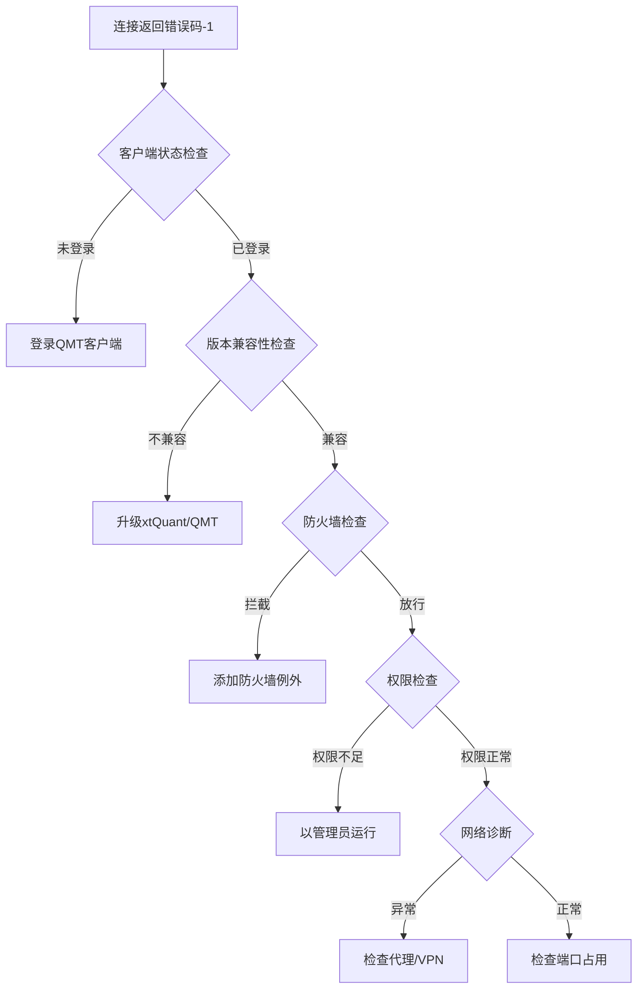

# QMT连接故障排查指南

## 错误码-1常见原因
1. QMT客户端未登录或登录异常
2. xtQuant版本与QMT客户端不兼容
3. 防火墙/安全软件拦截网络通信
4. 进程权限不足（未以管理员运行）
5. 网络配置问题（代理/VPN冲突）
6. 本地端口占用冲突
7. 客户端配置文件损坏

## 诊断流程图


## 解决方案对照表
| 问题类型 | 检测方法 | 解决方案 | 验证方式 |
|---------|---------|---------|---------|
| **客户端未登录** | 查看QMT客户端状态栏 | 重新登录QMT客户端 | `qmt_status_check.py` |
| **版本不兼容** | 对比xtQuant和QMT版本 | 升级至匹配版本 | `pip show xtquant` |
| **防火墙拦截** | 关闭防火墙测试 | 添加出站规则允许qmt.exe | `firewall_test.bat` |
| **权限不足** | 检查进程权限 | 以管理员运行Python脚本 | `run_as_admin.vbs` |
| **端口冲突** | `netstat -ano`查看端口 | 修改QMT配置端口 | `network_test.py` |

## 可视化检查清单
- [ ] QMT客户端登录状态正常（右下角托盘图标）
- [ ] xtQuant版本 ≥ 1.0.12 (支持QMT 3.6.5+)
- [ ] 防火墙已添加例外规则：
  ```powershell
  New-NetFirewallRule -DisplayName "QMT_Allow" -Direction Outbound -Program "C:\qmt\bin\qmt.exe" -Action Allow
  ```
- [ ] Python进程以管理员权限运行
- [ ] 网络代理/VPN已正确配置
- [ ] 21800-21810端口未被占用

## 自动检查脚本建议
```python
# qmt_diagnose.py
import os
import socket
from xtquant import xtdata

def check_qmt_login():
    try:
        return xtdata.is_connected()
    except:
        return False

def check_firewall():
    try:
        s = socket.socket()
        s.connect(("127.0.0.1", 21800))
        return True
    except:
        return False

if __name__ == "__main__":
    print(f"QMT登录状态: {'正常' if check_qmt_login() else '异常'}")
    print(f"防火墙通行: {'正常' if check_firewall() else '需配置例外'}")
    print(f"xtQuant版本: {xtdata.__version__}")